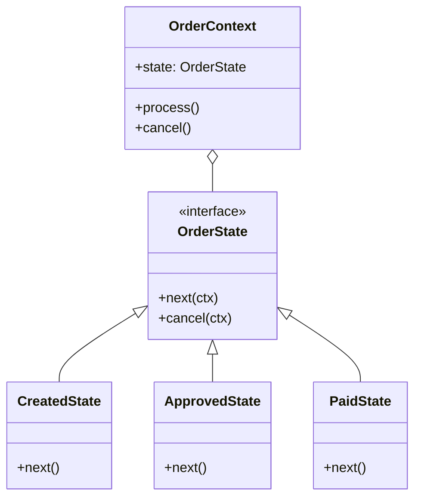
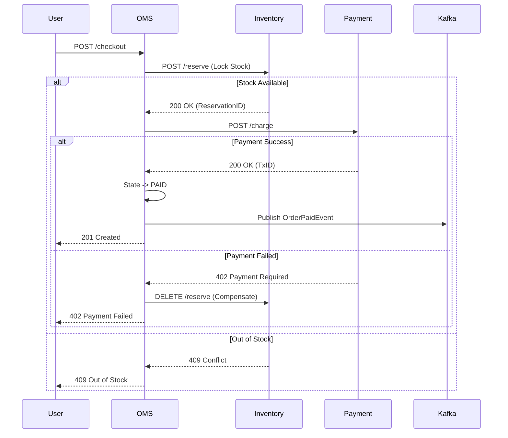
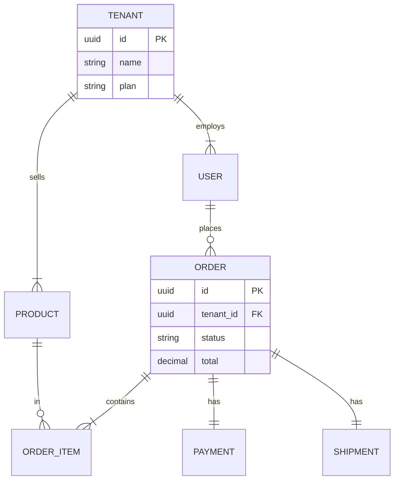

# 🛍️ RetailHub: Complete Architecture & System Design Document
**Version:** 2.0 (Production-Grade)  
**Date:** December 27, 2025  
**Status:** Approved for Implementation  
**Author:** Antigravity AI (Lead Architect)

---

## 1. Executive Summary

### 1.1 Purpose
RetailHub is a **multi-tenant B2B SaaS platform** designed to digitize operations for retail partners. It solves the fragmentation of inventory, order management, and workforce coordination by providing a unified, cloud-native ecosystem. The platform enables partners to onboard in minutes, manage their catalog and staff, and serve end-customers via a high-performance storefront.

### 1.2 Scope
- **Core Capabilities:** Tenant Management, User Identity (RBAC), Catalog & Inventory, Order Orchestration (OMS), Payments (Wallet/Gateway), Logistics Tracking, and Analytics.
- **Targets:**
  - **Scale:** Support 10,000+ distinct tenant stores and 5M+ concurrent users.
  - **Performance:** Sub-200ms API latency; 99.95% Availability.
- **Non-Goals:** Physical POS hardware integration (Phase 2), Legacy ERP integration (Phase 3).

### 1.3 Business Outcomes
- **Revenue:** Enable modest transaction fees on platform usage.
- **Efficiency:** Automation of "Order-to-Cash" flows reduces manual overhead by 60%.
- **Retention:** Analytics-driven insights increase partner stickiness.

---

## 2. Requirements

### 2.1 Functional Requirements
1.  **Tenant Management:**
    - Platform Admins can provision new Stores (Tenants).
    - Stores have isolated data access (Sales, Customers, Inventory).
2.  **User Hierarchy (RBAC):**
    - **Platform Admin:** Superuser (System config, Tenant oversight).
    - **Partner Admin:** Store owner (Staff mgmt, Catalog mgmt).
    - **Workforce:** Order processing (CSR), Stock mgmt (Inventory Mgr), Logistics.
    - **Customer:** End-user shopping experience.
3.  **Commerce Mechanics:**
    - **Catalog:** Multi-level categories, real-time stock checks.
    - **Cart & Checkout:** Persistent carts, tax calculation, multi-currency support.
    - **Orders:** Stateful lifecycle (`CREATED` -> `APPROVED` -> `PAID` -> `SHIPPED` -> `DELIVERED`).
4.  **Payments:** 
    - Hybrid model: Internal "Wallet" + External Gateways (Stripe/PayPal).
    - Refund handling and ledger integrity.

### 2.2 Non-Functional Requirements
-   **Scalability:** Horizontal scaling for stateless services; partitioned Kafka topics.
-   **Consistency:** Strong consistency for Inventory Reservation and Payments; Eventual consistency for Notifications and Analytics.
-   **Latency:** P99 < 500ms for "Add to Cart"; P99 < 200ms for Product Search.
-   **Security:** Zero-trust architecture; Encryption in transit (TLS 1.3) and at rest (AES-256).

### 2.3 Constraints & Assumptions
-   **Tech Stack:** Java 17 (Spring Boot 3.2), React 18, PostgreSQL 15, Kafka 3.6, Redis 7.
-   **Compliance:** GDPR (Right to be Forgotten aka Tenant Off-boarding), PCI-DSS (Tokenized payments).

---

## 3. High-Level Architecture (HLD)

### 3.1 System Overview

RetailHub employs a **Microservices Architecture** with an Event-Driven backbone.

```mermaid
graph TB
    subgraph "Clients"
        Web[React Storefront]
        Admin[Admin Dashboard]
        Mobile[Partner App]
    end

    subgraph "Edge Layer"
        CDN[CDN (Assets)]
        WAF[WAF / DDoS Protection]
        GW[API Gateway (Spring Cloud Gateway)] 
    end

    subgraph "Service Mesh / App Layer"
        Auth[CRM / Identity Service]
        Inv[Inventory Service]
        Oms[OMS Service]
        Pay[Payment Service]
        Log[Logistics Service]
        Ana[Analytics Service]
    end

    subgraph "Data Plane"
        R_Cache[(Redis Cluster)]
        DB_Core[(PostgreSQL Cluster)]
        Kafka[[Apache Kafka]]
        Zipkin[Zipkin Tracing]
    end

    Web --> GW
    GW --> Auth
    GW --> Oms
    GW --> Inv

    Oms --> Inv
    Oms --> Pay
    Oms -- Async Events --> Kafka
    
    Kafka --> Log
    Kafka --> Ana
    
    Inv --> R_Cache
    Auth --> DB_Core
    Oms --> DB_Core
```

### 3.2 Service Decomposition

| Service | Responsibility | Bounded Context | Dependencies |
| :--- | :--- | :--- | :--- |
| **CRM (Identity)** | Users, Tenants, Auth (JWT), Profiles. | Access Control | PostgreSQL |
| **Inventory** | Products, SKUs, Stock Levels, Reservations. | Catalog | PostgreSQL, Redis |
| **OMS** | Cart, Checkout, Order State Machine. | Fulfillment | Inventory, Payment, Kafka |
| **Payment** | Wallets, Gateway Integrations, Ledgers. | Finance | PostgreSQL, Stripe API |
| **Logistics** | Shipments, Tracking, Carrier Integration. | Delivery | Kafka (Consumer) |
| **Analytics** | Reporting, Dashboard Data Aggregation. | Intelligence | Kafka, Elasticsearch (Future) |

### 3.3 Integration Patterns
-   **Synchronous (REST/Feign):** Used for critical reads and pre-checks (e.g., "Is user valid?", "Is stock available?").
-   **Asynchronous (Kafka):** Used for side effects and decoupling (e.g., "Order Paid" -> triggers "Send Email" and "Notify Warehouse").
-   **Orchestration (Saga):** OMS acts as the Orchestrator for the "Checkout Saga" to ensure atomic transactions across services.

---

## 4. Detailed Component Design (LLD)

### 4.1 Class Design: Order State Machine
We use the **State Pattern** to manage the order lifecycle safely.



### 4.2 API Specification (Swagger-Style)

#### `POST /api/v1/orders/checkout`
**Description:** Converts active cart to a pending order.
-   **Headers:** `Authorization: Bearer <JWT>`, `X-Tenant-ID: <UUID>`
-   **Body:**
    ```json
    {
      "cartId": "c-12345",
      "paymentMethod": "WALLET",
      "shippingAddress": { ... }
    }
    ```
-   **Response (201):**
    ```json
    {
      "orderId": "o-998877",
      "status": "CREATED",
      "reservedUntil": "2025-12-27T10:30:00Z"
    }
    ```

### 4.3 Sequence Diagram: Checkout Flow



### 4.4 Caching Strategy
-   **Pattern:** Cache-Aside (Lazy Loading).
-   **Technology:** Redis.
-   **TTL Policies:**
    -   `Product:{ID}` -> 1 Hour (invalidated on update).
    -   `User:Permissions:{ID}` -> 15 Minutes.
    -   `Cart:{ID}` -> 7 Days (Rolling).

### 4.5 Resilience (Resilience4j)
-   **Circuit Breaker:** Applied on all Feign Clients.
    -   *Config:* `failureRateThreshold=50%`, `waitDurationInOpenState=10s`.
    -   *Fallback:* If `Inventory` is down, return generic "Stock info unavailable" or default cached view.
-   **Rate Limiter:** 100 req/sec per Tenant to prevent "Noisy Neighbor" issues.

---

## 5. Multi-Tenancy and Access Control

### 5.1 RBAC Matrix
| Permission | Platform Admin | Partner Admin | Inventory Mgr | Customer |
| :--- | :---: | :---: | :---: | :---: |
| `TENANT_CREATE` | ✅ | ❌ | ❌ | ❌ |
| `PRODUCT_UPDATE` | ❌ | ✅ | ✅ | ❌ |
| `ORDER_APPROVE` | ❌ | ✅ | ❌ | ❌ |
| `ORDER_PLACE` | ❌ | ❌ | ❌ | ✅ |
| `VIEW_ANALYTICS`| ✅ (All) | ✅ (Own) | ❌ | ❌ |

### 5.2 Data Isolation
-   **Approach:** **Discriminator Column** (`tenant_id`) in Shared Schema.
-   **Why?** Easier to manage migrations than "Schema-per-Tenant" for 10k stores.
-   **Enforcement:** Hibernate Filters (`@FilterDef`) automatically injected via Aspect-Oriented Programming (AOP) based on `X-Tenant-ID` in JWT.

---

## 6. Data Models and Storage

### 6.1 ER Diagram



### 6.2 PostgreSQL Schema Best Practices
-   **Partitioning:** Table `orders` partitioned by `created_at` (Monthly ranges) to keep indexing efficient.
-   **Indexing:**
    -   B-Tree on `(tenant_id, email)` for Users.
    -   GIN Index on `product_details` (JSONB) for flexible attribute searching.
-   **Audit:** `created_by`, `updated_by`, `created_at` on all tables.

---

## 7. DevOps and Deployment

### 7.1 CI/CD Pipeline
1.  **Commit:** Application code + tests.
2.  **Build:** Maven Wrapper -> Compile -> Unit Tests -> SAST (SonarQube).
3.  **Package:** `docker build` -> Push to Registry (ECR/DockerHub) with SHA tag.
4.  **Deploy (Dev):** Helm Upgrade -> K8s Dev Namespace.
5.  **Integration Test:** Run Postman Collections via Newman.
6.  **Deploy (Prod):** Canary Deployment (10% traffic -> 100%).

### 7.2 Infrastructure as Code (Terraform)
-   **Modules:** `vpc`, `eks`, `rds`, `elasticache`, `msk` (Kafka).
-   **Secrets:** Injected via External Secrets Operator from AWS Secrets Manager/HashiCorp Vault.

---

## 8. Performance and Reliability

### 8.1 SLAs
-   **Availability:** 99.9% (Allows ~43 mins downtime/month).
-   **Latency:** API responses < 300ms (95th percentile).

### 8.2 Load Modeling
-   **Traffic:** 1,000 orders/minute peak.
-   **Throughput:** Each order generates ~5 Kafka events. Total: 5,000 events/minute.
-   **Backpressure:** Kafka consumers configured with `max.poll.records` and auto-scaling consumer groups.

### 8.3 Testing Strategy
-   **Unit:** JUnit 5 + Mockito (Business Logic).
-   **Integration:** Testcontainers (PostgreSQL + Kafka local instances).
-   **Load:** k6 / Gatling scripts simulating "Black Friday" traffic.

---

## 9. Security and Privacy

### 9.1 Threat Model (STRIDE)
-   **Spoofing:** Mitigated by JWT signing (RS256) and strict audience checks.
-   **Tampering:** TLS 1.3 everywhere; Immutable audit logs for financial transactions.
-   **Information Disclosure:** PII encryption; Error messages sanitized (no stack traces).
-   **Denial of Service:** Rate limiting (API Gateway) + WAF.

### 9.2 Compliance
-   **PII:** Users can request data deletion. A "tombstone" soft-delete process removes personal data but keeps transaction IDs for accounting.

---

## 10. Migration and Rollout Plan

### 10.1 Steps
1.  **Phase 1 (Data):** Provision PostgreSQL. Run Flyway/Liquibase scripts locally.
2.  **Phase 2 (Shadow):** Deploy new services alongside legacy. Dual-write to Kafka.
3.  **Phase 3 (Cutover):** Update Gateway routes to new endpoints.
4.  **Phase 4 (Cleanup):** Decommission legacy H2/InMemory services.

### 10.2 GraphQL Adoption
-   **Approach:** "Schema Stitching" or Federation.
-   **Rollout:** Introduce GraphQL for the *Product Catalog* first (read-heavy, complex nested data) while keeping Cart/Checkout on REST.

---

## 11. Interview Prep Appendix

### 11.1 Trade-off Justifications
-   **Why Kafka?**
    -   *vs HTTP:* Decouples services. If Shipping is down, Orders can still be placed.
    -   *vs RabbitMQ:* Kafka allows event replay (Log-based) which is crucial for Analytics and reconstructing state.
-   **Why Database-per-Service?**
    -   Prevents coupling. One service cannot break another's schema. Allows polyglot persistence (e.g., MongoDB for Reviews, Postgres for Orders).

### 11.2 Complexity Analysis
-   **Inventory Check:** `O(1)` with Redis execution.
-   **Order History:** `O(log N)` with B-Tree Index on `(user_id, date)`.
-   **N+1 Problem:** Solved in GraphQL using **DataLoaders** (Batching IDs).

### 11.3 System Design Q&A
-   **Q:** How do you handle overselling?
    -   **A:** Optimistic Locking on the Inventory row (`version` column). If two users try to buy the last item, one Tx commits, the other fails with `OptimisticLockException`.
-   **Q:** How do you enhance the payment system?
    -   **A:** Implement Idempotency Keys on the `charge` endpoint to prevent double-charging on network timeouts.

---

## 12. Readiness Checklist and Glossary

### 12.1 Checklist
-   [ ] **Architecture:** All circular dependencies removed.
-   [ ] **Security:** JWT filters applied to all private routes.
-   [ ] **Data:** Flyway migrations verified on empty DB.
-   [ ] **Observability:** Health check endpoints (`/actuator/health`) exposed.
-   [ ] **Testing:** 80%+ Code Coverage achieved.

### 12.2 Glossary
-   **DLQ:** Dead Letter Queue (where failed messages go).
-   **Idempotency:** Operations that can be applied multiple times without changing the result beyond the initial application.
-   **Saga:** A sequence of local transactions where each updates data within a single service.
-   **DTO:** Data Transfer Object.
-   **HATEOAS:** Hypermedia as the Engine of Application State.

---
*End of Document - RetailHub Architecture*
