# RetailHub: Complete Technical Documentation & Interview Guide

**Version**: 3.0 - Interview Preparation Edition  
**Last Updated**: December 26, 2025  
**Purpose**: Comprehensive learning material covering Architecture, Design Patterns, Technologies, and Interview Concepts

---

## 📋 Table of Contents

1. [Project Overview](#1-project-overview)
2. [System Architecture](#2-system-architecture)
3. [Technology Stack Deep Dive](#3-technology-stack-deep-dive)
4. [Design Patterns Implementation](#4-design-patterns-implementation)
5. [Microservices Concepts](#5-microservices-concepts)
6. [Database & Persistence](#6-database--persistence)
7. [API Design & REST Principles](#7-api-design--rest-principles)
8. [Frontend Architecture](#8-frontend-architecture)
9. [Security & Authentication](#9-security--authentication)
10. [Message Queuing & Event-Driven Architecture](#10-message-queuing--event-driven-architecture)
11. [DevOps & Deployment](#11-devops--deployment)
12. [Interview Questions & Answers](#12-interview-questions--answers)

---

## 1. Project Overview

### 1.1 Business Context
RetailHub is a **multi-tenant e-commerce platform** that simulates real-world enterprise workflows. Unlike traditional CRUD applications, it implements:
- **Role-Based Access Control (RBAC)** with three distinct user personas
- **Stateful Order Management** with explicit approval workflows
- **Digital Wallet System** for payment processing
- **Event-Driven Architecture** for asynchronous notifications

### 1.2 Learning Objectives
This project was specifically designed to master:
1. **Object-Oriented Design (OOD)**: SOLID principles, Design Patterns
2. **Microservices Architecture**: Service decomposition, inter-service communication
3. **Distributed Systems**: CAP theorem, eventual consistency
4. **Enterprise Patterns**: Repository, Service Layer, DTO, Orchestrator
5. **Full-Stack Development**: Backend (Spring Boot) + Frontend (React)

### 1.3 Key Features
- ✅ User Registration with automatic wallet provisioning
- ✅ Product catalog management with real-time stock updates
- ✅ Multi-stage order approval workflow (Customer → CSR → Payment → Logistics)
- ✅ Digital wallet with balance tracking and transaction history
- ✅ Real-time UI updates via polling
- ✅ Asynchronous event processing via Kafka

---

## 2. System Architecture

### 2.1 Architecture Style: Microservices

**What is Microservices Architecture?**
Microservices is an architectural style where an application is composed of small, independent services that:
- Run in their own process
- Communicate via lightweight protocols (HTTP/REST, Message Queues)
- Are independently deployable
- Are organized around business capabilities

**Why Microservices for RetailHub?**
1. **Separation of Concerns**: Each service handles one business domain
2. **Independent Scaling**: Can scale Payment service separately from Inventory
3. **Technology Diversity**: Could use different databases per service
4. **Fault Isolation**: If Notification service fails, orders still process
5. **Team Autonomy**: Different teams can own different services

### 2.2 System Architecture Diagram

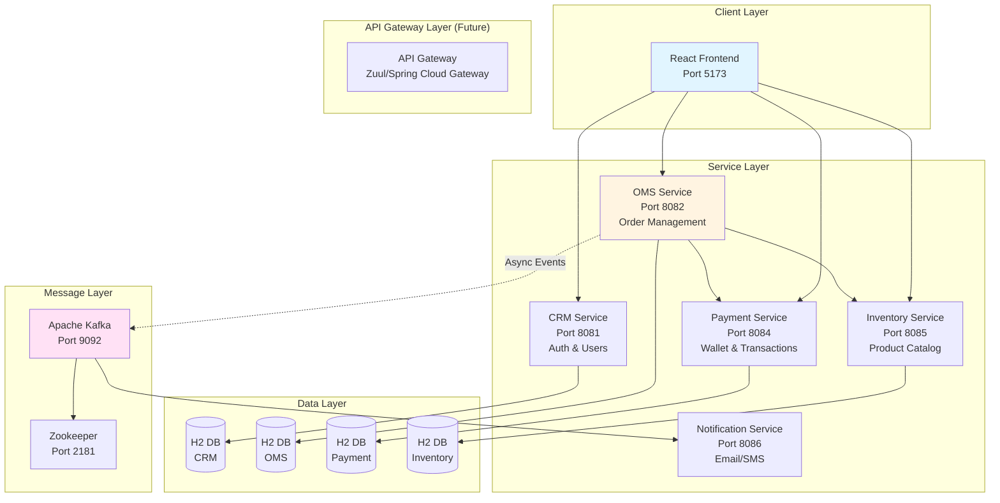

### 2.3 Service Responsibilities

| Service | Port | Database | Primary Responsibility | Key Entities |
|---------|------|----------|------------------------|--------------|
| **CRM** | 8081 | H2 (users) | Identity & Access Management | AppUser |
| **OMS** | 8082 | H2 (orders) | Order Lifecycle Orchestration | Order, OrderContext |
| **Payment** | 8084 | H2 (wallets) | Financial Transactions | Wallet, PaymentRecord |
| **Inventory** | 8085 | H2 (products) | Stock Management | Product |
| **Notification** | 8086 | None | Event Processing | N/A (Stateless) |

---

## 3. Technology Stack Deep Dive

### 3.1 Backend Technologies

#### 3.1.1 Spring Boot 3.2.0
**What is Spring Boot?**
Spring Boot is an opinionated framework built on top of the Spring Framework that simplifies the development of production-ready applications.

**Why Spring Boot?**
- ✅ **Auto-Configuration**: Automatically configures beans based on classpath
- ✅ **Embedded Server**: Tomcat embedded, no need for external server
- ✅ **Production-Ready**: Built-in health checks, metrics (Actuator)
- ✅ **Microservices Support**: Easy integration with Spring Cloud
- ✅ **Dependency Management**: Starter POMs reduce configuration

**Key Spring Boot Features Used:**
```java
// Example: Auto-configured DataSource
@SpringBootApplication
public class OmsApplication {
    public static void main(String[] args) {
        SpringApplication.run(OmsApplication.class, args);
    }
}
```

**Interview Concept: Inversion of Control (IoC)**
Spring manages object creation and dependency injection:
```java
@RestController
public class OmsController {
    @Autowired  // Spring injects this dependency
    private OrderRepository repository;
}
```

#### 3.1.2 Spring Data JPA
**What is JPA?**
Java Persistence API - a specification for ORM (Object-Relational Mapping).

**Why Spring Data JPA?**
- ✅ **Repository Pattern**: Eliminates boilerplate CRUD code
- ✅ **Query Methods**: Auto-generates queries from method names
- ✅ **Transaction Management**: Declarative with `@Transactional`
- ✅ **Database Agnostic**: Switch databases without code changes

**Example:**
```java
public interface OrderRepository extends JpaRepository<Order, Long> {
    List<Order> findByStatus(String status);  // Auto-implemented!
    List<Order> findByCustomerId(String customerId);
}
```

**Interview Question**: What's the difference between JPA and Hibernate?
- **JPA**: Specification (interface)
- **Hibernate**: Implementation of JPA (most popular)

#### 3.1.3 Spring Web (REST)
**RESTful API Design:**
```java
@RestController
@RequestMapping("/api/oms")
@CrossOrigin(origins = "*")  // CORS for frontend
public class OmsController {
    
    @PostMapping("/create")  // POST for creation
    public Order createOrder(@RequestParam String sku) { }
    
    @GetMapping("/pending")  // GET for retrieval
    public List<Order> getPending() { }
}
```

**HTTP Methods Used:**
- `GET`: Retrieve resources (idempotent)
- `POST`: Create resources (non-idempotent)
- `PUT`: Update resources (idempotent)
- `DELETE`: Remove resources (idempotent)

#### 3.1.4 H2 Database
**What is H2?**
An in-memory, embedded Java SQL database.

**Why H2 for Development?**
- ✅ **Zero Setup**: No installation required
- ✅ **Fast**: Runs in memory
- ✅ **Embedded Console**: Built-in web UI at `/h2-console`
- ✅ **SQL Compatible**: Easy migration to MySQL/PostgreSQL

**Configuration:**
```properties
spring.datasource.url=jdbc:h2:mem:testdb
spring.jpa.hibernate.ddl-auto=update  # Auto-create tables
spring.h2.console.enabled=true
```

**Interview Concept**: Why in-memory for production?
- ❌ **Not for Production**: Data lost on restart
- ✅ **For Development**: Fast iteration, no state pollution between tests

### 3.2 Frontend Technologies

#### 3.2.1 React 18
**What is React?**
A JavaScript library for building user interfaces using a component-based architecture.

**Why React?**
- ✅ **Component Reusability**: Build once, use everywhere
- ✅ **Virtual DOM**: Efficient rendering
- ✅ **Unidirectional Data Flow**: Predictable state management
- ✅ **Rich Ecosystem**: Huge community, libraries

**Key Concepts Used:**

**1. Functional Components & Hooks:**
```javascript
export default function StorefrontSection({ currentUser }) {
    const [products, setProducts] = useState([]);  // State Hook
    const [balance, setBalance] = useState(0);
    
    useEffect(() => {  // Effect Hook (lifecycle)
        fetchData();
        const interval = setInterval(fetchData, 2000);  // Polling
        return () => clearInterval(interval);  // Cleanup
    }, [currentUser]);  // Dependency array
}
```

**2. Props & State:**
- **Props**: Data passed from parent to child (immutable)
- **State**: Component's internal data (mutable via setState)

#### 3.2.2 Vite
**What is Vite?**
A next-generation frontend build tool.

**Why Vite over Create-React-App?**
- ✅ **Instant Server Start**: Uses native ES modules
- ✅ **Lightning Fast HMR**: Hot Module Replacement in milliseconds
- ✅ **Optimized Build**: Uses Rollup for production
- ✅ **Modern**: Built for ES2015+ browsers

#### 3.2.3 Framer Motion
**What is Framer Motion?**
A production-ready animation library for React.

**Why Animations?**
- ✅ **User Feedback**: Visual confirmation of actions
- ✅ **Professional Feel**: Smooth transitions improve UX
- ✅ **Attention Direction**: Guide user focus

**Example:**
```javascript
<motion.div
    initial={{ opacity: 0, y: -20 }}
    animate={{ opacity: 1, y: 0 }}
    exit={{ opacity: 0 }}
    className="notification"
>
    {notification.msg}
</motion.div>
```

### 3.3 Message Queue: Apache Kafka

**What is Kafka?**
A distributed event streaming platform for high-throughput, fault-tolerant messaging.

**Why Kafka?**
- ✅ **Decoupling**: OMS doesn't need to know about Notification service
- ✅ **Scalability**: Can handle millions of messages/sec
- ✅ **Durability**: Messages persisted to disk
- ✅ **Replay**: Can re-process old events

**Architecture:**
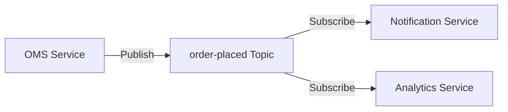

**Key Concepts:**
- **Producer**: OMS publishes events
- **Topic**: Logical channel (e.g., `order-placed`)
- **Consumer**: Notification service subscribes
- **Partition**: For parallel processing
- **Zookeeper**: Manages Kafka cluster metadata

**Interview Question**: Kafka vs RabbitMQ?
| Feature | Kafka | RabbitMQ |
|---------|-------|----------|
| **Use Case** | Event Streaming | Message Queuing |
| **Throughput** | Very High | Moderate |
| **Message Retention** | Configurable (days) | Until consumed |
| **Order Guarantee** | Per partition | Per queue |

---

## 4. Design Patterns Implementation

### 4.1 State Pattern (Behavioral)

**Problem Statement:**
An Order has complex lifecycle rules:
- Can't ship before payment
- Can't pay before approval
- Can't approve twice

**Traditional Approach (Anti-Pattern):**
```java
// BAD: Leads to spaghetti code
public void processOrder(Order order, String action) {
    if (action.equals("approve")) {
        if (!order.isApproved && !order.isPaid) {
            order.isApproved = true;
        }
    } else if (action.equals("pay")) {
        if (order.isApproved && !order.isPaid) {
            order.isPaid = true;
        }
    }
    // ... becomes unmaintainable
}
```

**State Pattern Solution:**

**UML Class Diagram:**
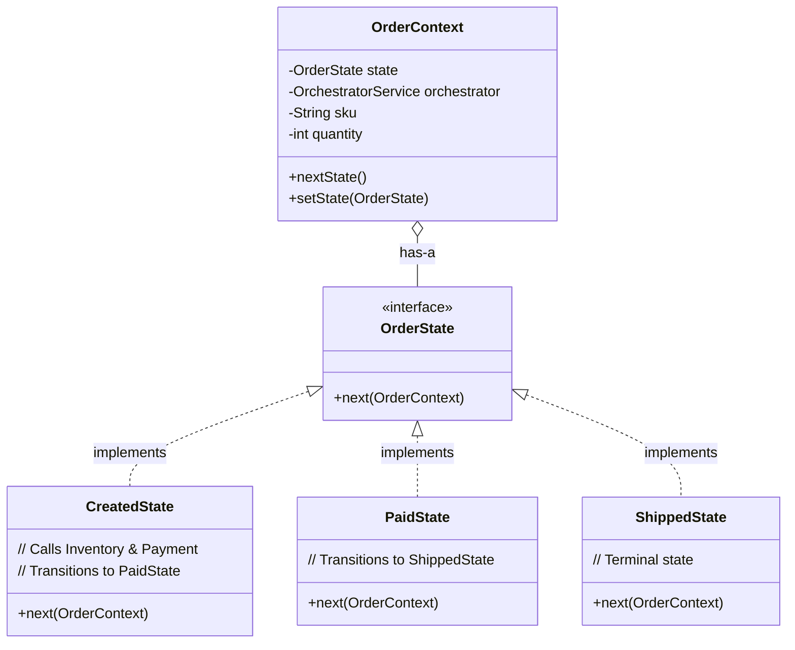

**Implementation:**
```java
// State Interface
public interface OrderState {
    void next(OrderContext context);
}

// Concrete State
public class CreatedState implements OrderState {
    @Override
    public void next(OrderContext context) {
        // Business logic: Check inventory
        boolean stockAvailable = context.getOrchestrator()
            .reserveStock(context.getSku(), context.getQuantity());
        
        if (stockAvailable) {
            // Business logic: Process payment
            boolean paid = context.getOrchestrator()
                .processPayment("paypal", "user", 999.0);
            
            if (paid) {
                context.setState(new PaidState());  // Transition
            }
        }
    }
}

// Context
public class OrderContext {
    private OrderState state;
    
    public void nextState() {
        state.next(this);  // Delegate to current state
    }
}
```

**Benefits:**
- ✅ **Open/Closed Principle**: Add new states without modifying existing code
- ✅ **Single Responsibility**: Each state class handles one lifecycle stage
- ✅ **Eliminates Conditionals**: No more giant if-else blocks

**Interview Question**: When to use State Pattern?
- When object behavior changes based on internal state
- When you have multiple conditional statements based on state
- When state transitions are complex

### 4.2 Strategy Pattern (Behavioral)

**Problem Statement:**
Support multiple payment methods (PayPal, Stripe, Wallet) without tight coupling.

**UML Diagram:**
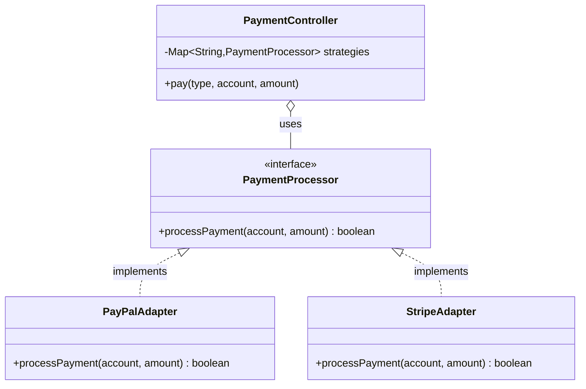

**Implementation:**
```java
// Strategy Interface
public interface PaymentProcessor {
    boolean processPayment(String accountId, double amount);
}

// Concrete Strategy 1
@Component("paypalAdapter")
public class PayPalAdapter implements PaymentProcessor {
    @Override
    public boolean processPayment(String accountId, double amount) {
        // PayPal-specific logic
        System.out.println("Processing via PayPal: " + amount);
        return Math.random() > 0.1;  // 90% success rate
    }
}

// Concrete Strategy 2
@Component("stripeAdapter")
public class StripeAdapter implements PaymentProcessor {
    @Override
    public boolean processPayment(String accountId, double amount) {
        // Stripe-specific logic
        System.out.println("Processing via Stripe: " + amount);
        return Math.random() > 0.05;  // 95% success rate
    }
}

// Context
@RestController
public class PaymentController {
    private final Map<String, PaymentProcessor> strategies;
    
    @Autowired
    public PaymentController(List<PaymentProcessor> processors) {
        this.strategies = new HashMap<>();
        for (PaymentProcessor p : processors) {
            if (p instanceof PayPalAdapter) strategies.put("paypal", p);
            if (p instanceof StripeAdapter) strategies.put("stripe", p);
        }
    }
    
    @PostMapping("/pay")
    public boolean pay(@RequestParam String type, 
                       @RequestParam String account,
                       @RequestParam double amount) {
        PaymentProcessor processor = strategies.get(type);
        return processor.processPayment(account, amount);
    }
}
```

**Benefits:**
- ✅ **Runtime Selection**: Choose algorithm at runtime
- ✅ **Easy Extension**: Add new payment methods without modifying existing code
- ✅ **Testability**: Mock individual strategies

### 4.3 Repository Pattern (Structural)

**Problem Statement:**
Decouple business logic from data access logic.

**Without Repository (Anti-Pattern):**
```java
@RestController
public class OrderController {
    @Autowired
    private EntityManager em;  // Direct DB access
    
    @GetMapping("/orders")
    public List<Order> getOrders() {
        return em.createQuery("SELECT o FROM Order o", Order.class)
                 .getResultList();  // SQL in controller!
    }
}
```

**With Repository:**
```java
// Repository Interface
public interface OrderRepository extends JpaRepository<Order, Long> {
    List<Order> findByStatus(String status);
    List<Order> findByCustomerId(String customerId);
}

// Controller (Clean)
@RestController
public class OrderController {
    @Autowired
    private OrderRepository repository;
    
    @GetMapping("/orders")
    public List<Order> getOrders() {
        return repository.findAll();  // No SQL!
    }
}
```

**Benefits:**
- ✅ **Separation of Concerns**: Controllers don't know about SQL
- ✅ **Testability**: Can mock repository
- ✅ **Flexibility**: Swap database without changing business logic

### 4.4 Orchestrator Pattern (Architectural)

**Problem Statement:**
OMS needs to coordinate multiple services (Inventory, Payment) to complete an order.

**Choreography vs Orchestration:**

**Choreography (Decentralized):**
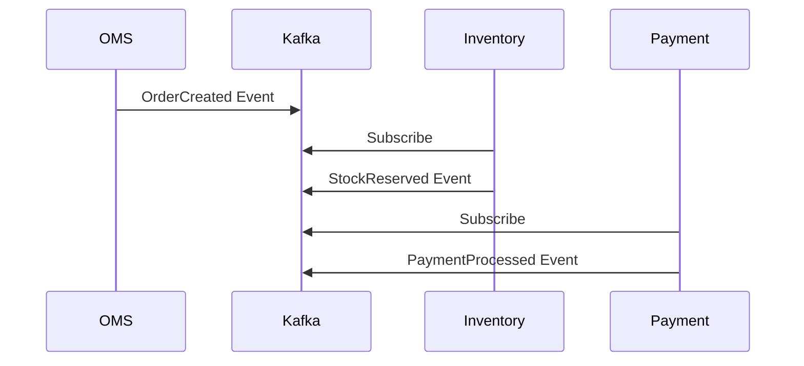
❌ **Problem**: Hard to track overall flow, no single source of truth

**Orchestration (Centralized):**
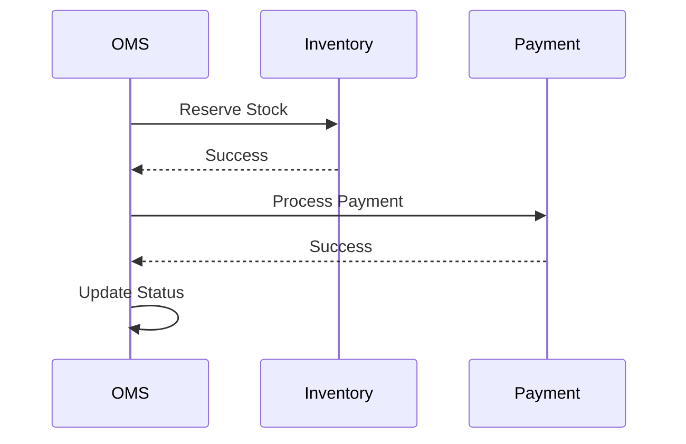
✅ **Benefit**: OMS controls the flow

**Implementation:**
```java
@Service
public class OrchestratorService {
    private final RestTemplate restTemplate = new RestTemplate();
    
    public boolean reserveStock(String sku, int qty) {
        String url = "http://localhost:8085/api/inventory/check?sku=" + sku;
        Boolean result = restTemplate.getForObject(url, Boolean.class);
        return result != null && result;
    }
    
    public boolean processPayment(String type, String user, double amount) {
        String url = "http://localhost:8084/api/payment/pay?type=" + type;
        Boolean result = restTemplate.postForObject(url, null, Boolean.class);
        return result != null && result;
    }
}
```

---

## 5. Microservices Concepts

### 5.1 Service Decomposition

**How did we decompose RetailHub?**

**By Business Capability:**
- **CRM**: User management (bounded context: Identity)
- **OMS**: Order processing (bounded context: Orders)
- **Inventory**: Stock management (bounded context: Products)
- **Payment**: Financial transactions (bounded context: Billing)

**Domain-Driven Design (DDD) Principles:**
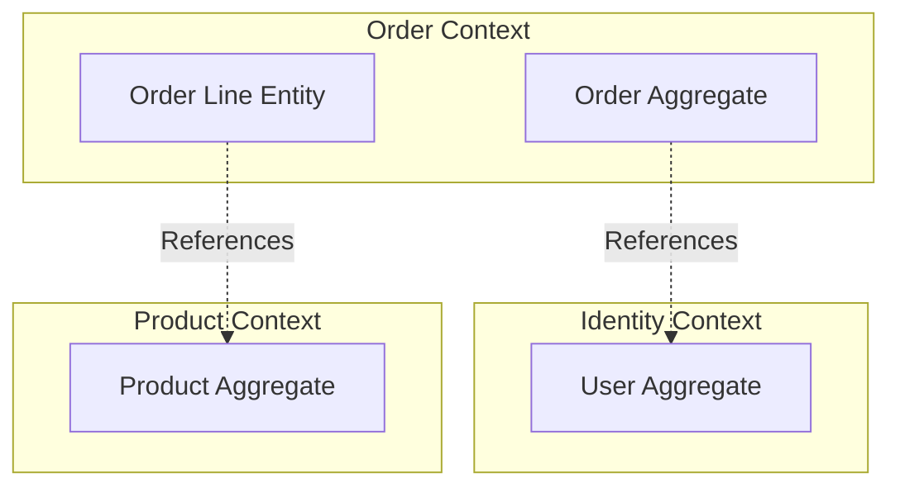

### 5.2 Inter-Service Communication

**Synchronous (REST):**
```java
// OMS calls Inventory synchronously
RestTemplate restTemplate = new RestTemplate();
Boolean stockAvailable = restTemplate.getForObject(
    "http://inventory-service/check?sku=IPHONE15", 
    Boolean.class
);
```

**Pros:**
- ✅ Immediate response
- ✅ Simple to implement

**Cons:**
- ❌ Tight coupling
- ❌ Cascading failures

**Asynchronous (Kafka):**
```java
// OMS publishes event
kafkaTemplate.send("order-placed", orderEvent);

// Notification service consumes
@KafkaListener(topics = "order-placed")
public void handleOrderPlaced(OrderEvent event) {
    sendEmail(event.getCustomerEmail());
}
```

**Pros:**
- ✅ Loose coupling
- ✅ Fault tolerance

**Cons:**
- ❌ Eventual consistency
- ❌ Complex debugging

### 5.3 Database Per Service

**Why separate databases?**
- ✅ **Autonomy**: Each team owns their data
- ✅ **Scalability**: Scale databases independently
- ✅ **Technology Choice**: Use SQL for Orders, NoSQL for Logs

**Challenge: Distributed Transactions**

**Problem**: What if Inventory is reserved but Payment fails?

**Solution 1: Saga Pattern**
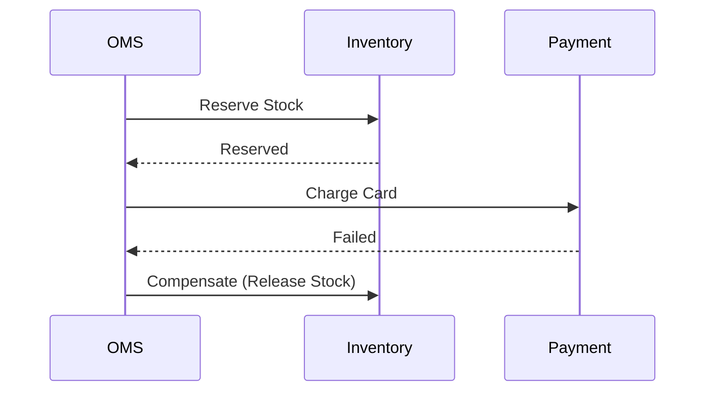

**Solution 2: Two-Phase Commit (2PC)**
- ❌ Not used in RetailHub (complex, performance overhead)

### 5.4 API Gateway (Future Enhancement)

**Current Architecture:**
```
Frontend → CRM (Port 8081)
Frontend → OMS (Port 8082)
Frontend → Payment (Port 8084)
```

**With API Gateway:**
```
Frontend → API Gateway (Port 8080) → CRM/OMS/Payment
```

**Benefits:**
- ✅ **Single Entry Point**: Frontend calls one URL
- ✅ **Cross-Cutting Concerns**: Authentication, rate limiting, logging
- ✅ **Protocol Translation**: REST to gRPC

---

## 6. Database & Persistence

### 6.1 JPA Entity Mapping

**Entity Example:**
```java
@Entity
@Table(name = "feature_orders")
public class Order {
    @Id
    @GeneratedValue(strategy = GenerationType.IDENTITY)
    private Long id;
    
    private String customerId;
    private String sku;
    private int quantity;
    private double amount;
    private String status;
    
    // Getters and Setters
}
```

**Annotations Explained:**
- `@Entity`: Marks class as JPA entity
- `@Table`: Maps to database table
- `@Id`: Primary key
- `@GeneratedValue`: Auto-increment strategy

### 6.2 Transaction Management

**Declarative Transactions:**
```java
@Service
public class OrderService {
    @Transactional  // ACID guarantee
    public void createOrder(Order order) {
        orderRepository.save(order);
        // If exception occurs here, save() is rolled back
        kafkaTemplate.send("order-placed", order);
    }
}
```

**ACID Properties:**
- **Atomicity**: All or nothing
- **Consistency**: Valid state transitions
- **Isolation**: Concurrent transactions don't interfere
- **Durability**: Committed data persists

**Interview Question**: What is the default isolation level in Spring?
- **Answer**: `READ_COMMITTED` (prevents dirty reads)

### 6.3 N+1 Query Problem

**Problem:**
```java
List<Order> orders = orderRepository.findAll();  // 1 query
for (Order order : orders) {
    Customer customer = customerRepository.findById(order.getCustomerId());  // N queries
}
```

**Solution: JOIN FETCH**
```java
@Query("SELECT o FROM Order o JOIN FETCH o.customer")
List<Order> findAllWithCustomer();
```

---

## 7. API Design & REST Principles

### 7.1 RESTful Resource Naming

**Good:**
```
GET    /api/orders          # List orders
POST   /api/orders          # Create order
GET    /api/orders/123      # Get specific order
PUT    /api/orders/123      # Update order
DELETE /api/orders/123      # Delete order
```

**Bad:**
```
GET    /api/getOrders       # Verb in URL
POST   /api/order/create    # Redundant
GET    /api/orders/delete/123  # Wrong method
```

### 7.2 HTTP Status Codes

**Used in RetailHub:**
- `200 OK`: Successful GET/PUT
- `201 Created`: Successful POST
- `400 Bad Request`: Invalid input
- `401 Unauthorized`: Missing credentials
- `403 Forbidden`: Insufficient permissions
- `404 Not Found`: Resource doesn't exist
- `500 Internal Server Error`: Server crash

### 7.3 CORS (Cross-Origin Resource Sharing)

**Problem**: Browser blocks requests from `localhost:5173` to `localhost:8082`

**Solution:**
```java
@CrossOrigin(origins = "*")  // Allow all origins (dev only)
@RestController
public class OmsController { }
```

**Production:**
```java
@CrossOrigin(origins = "https://retailhub.com")
```

---

## 8. Frontend Architecture

### 8.1 Component Hierarchy

```
App.jsx (Root)
├── LoginSection.jsx (Auth)
├── StorefrontSection.jsx (Customer)
│   ├── ProductCard (Reusable)
│   └── OrderList (Reusable)
├── CsrDashboard.jsx (CSR)
└── ShippingDashboard.jsx (Logistics)
```

### 8.2 State Management

**Local State (useState):**
```javascript
const [balance, setBalance] = useState(0);  // Component-specific
```

**Lifted State (Props):**
```javascript
// App.jsx
const [userName, setUserName] = useState(null);

// Pass down
<StorefrontSection currentUser={userName} />
```

**When to use Context API / Redux?**
- When state is needed by many components
- When prop drilling becomes excessive
- RetailHub is simple enough for prop passing

### 8.3 Side Effects (useEffect)

**Data Fetching:**
```javascript
useEffect(() => {
    const fetchData = async () => {
        const res = await fetch('http://localhost:8082/api/oms/my-orders');
        const data = await res.json();
        setOrders(data);
    };
    fetchData();
}, []);  // Empty array = run once on mount
```

**Polling:**
```javascript
useEffect(() => {
    const interval = setInterval(fetchData, 2000);  // Every 2 seconds
    return () => clearInterval(interval);  // Cleanup on unmount
}, [customer]);  // Re-run when customer changes
```

---

## 9. Security & Authentication

### 9.1 Authentication Flow

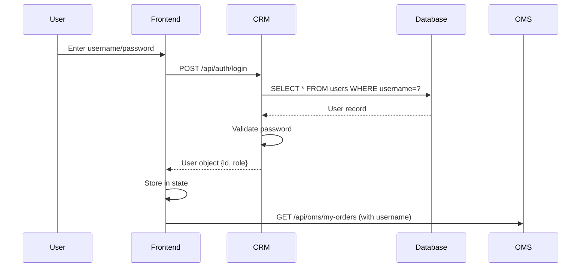

### 9.2 Spring Security (CRM Service)

**Configuration:**
```java
@Configuration
@EnableWebSecurity
public class SecurityConfig {
    @Bean
    public SecurityFilterChain filterChain(HttpSecurity http) throws Exception {
        http
            .authorizeHttpRequests(auth -> auth
                .requestMatchers("/api/auth/**").permitAll()  // Public
                .requestMatchers("/api/admin/**").hasRole("ADMIN")  // Protected
                .anyRequest().authenticated()
            )
            .httpBasic();  // Basic Auth
        return http.build();
    }
}
```

**Interview Question**: What's the difference between Authentication and Authorization?
- **Authentication**: Who are you? (Login)
- **Authorization**: What can you do? (Permissions)

### 9.3 Password Security

**Current (Demo):**
```java
user.getPassword().equals(inputPassword)  // Plain text comparison
```

**Production:**
```java
BCryptPasswordEncoder encoder = new BCryptPasswordEncoder();
String hashed = encoder.encode("password123");  // Store this
encoder.matches(inputPassword, hashed);  // Verify
```

**Why BCrypt?**
- ✅ **Salted**: Different hash for same password
- ✅ **Slow**: Resistant to brute force
- ✅ **Adaptive**: Can increase rounds over time

---

## 10. Message Queuing & Event-Driven Architecture

### 10.1 Kafka Architecture

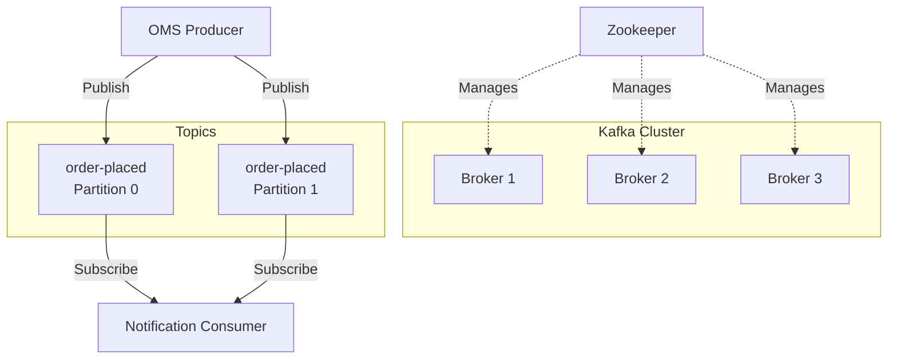

### 10.2 Producer Implementation

```java
@Service
public class OrderEventPublisher {
    @Autowired
    private KafkaTemplate<String, OrderEvent> kafkaTemplate;
    
    public void publishOrderPlaced(Order order) {
        OrderEvent event = new OrderEvent(
            order.getId(),
            order.getCustomerId(),
            order.getAmount()
        );
        kafkaTemplate.send("order-placed", event);
    }
}
```

### 10.3 Consumer Implementation

```java
@Service
public class NotificationService {
    @KafkaListener(topics = "order-placed", groupId = "notification-group")
    public void handleOrderPlaced(OrderEvent event) {
        System.out.println("Sending email for order: " + event.getOrderId());
        // Send email logic
    }
}
```

### 10.4 Event Sourcing Concept

**Traditional CRUD:**
```
users table: {id: 1, balance: 500}
```
❌ **Problem**: Lost history (was it 1000 → 500 or 0 → 500?)

**Event Sourcing:**
```
events table:
{id: 1, type: "WALLET_CREATED", amount: 1000}
{id: 2, type: "PAYMENT_MADE", amount: -500}
Current balance = SUM(events) = 500
```
✅ **Benefit**: Full audit trail

---

## 11. DevOps & Deployment

### 11.1 Docker Compose

**docker-compose.yml:**
```yaml
version: '3.8'
services:
  mysql:
    image: mysql:8.0
    ports:
      - "3306:3306"
    environment:
      MYSQL_ROOT_PASSWORD: root
      MYSQL_DATABASE: retailhub
  
  zookeeper:
    image: confluentinc/cp-zookeeper:latest
    ports:
      - "2181:2181"
  
  kafka:
    image: confluentinc/cp-kafka:latest
    ports:
      - "9092:9092"
    depends_on:
      - zookeeper
```

**Why Docker?**
- ✅ **Consistency**: Same environment everywhere
- ✅ **Isolation**: Services don't conflict
- ✅ **Portability**: Run anywhere

### 11.2 Build & Deployment Scripts

**start-all.bat:**
```batch
@echo off
echo Starting Docker Infrastructure...
docker-compose up -d

echo Launching Backend Services...
start /min cmd /k "cd crm-service && mvn spring-boot:run"
start /min cmd /k "cd oms-service && mvn spring-boot:run"
start /min cmd /k "cd payment-service && mvn spring-boot:run"
start /min cmd /k "cd inventory-service && mvn spring-boot:run"

echo Launching Frontend...
cd retail-client && npm run dev
```

**Benefits:**
- ✅ **One Command**: Start entire system
- ✅ **Background Execution**: Services run hidden
- ✅ **Logging**: Output redirected to files

### 11.3 CI/CD Pipeline (Future)

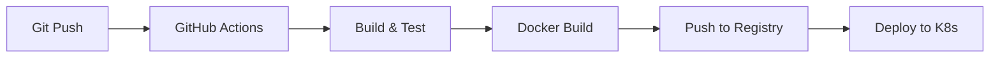

**Tools:**
- **CI**: GitHub Actions, Jenkins
- **Container Registry**: Docker Hub, AWS ECR
- **Orchestration**: Kubernetes, Docker Swarm

---

## 12. Interview Questions & Answers

### 12.1 Design Patterns

**Q1: Explain the State Pattern with a real example from your project.**

**Answer:**
"In RetailHub's OMS service, I implemented the State Pattern to manage order lifecycle. An order can be in states like CREATED, APPROVED, PAID, or SHIPPED. Instead of using multiple boolean flags and if-else chains, I created separate state classes (CreatedState, PaidState, etc.) that implement an OrderState interface. Each state class encapsulates the behavior and transition logic for that specific state. For example, CreatedState handles inventory reservation and transitions to PaidState upon successful payment. This follows the Open/Closed Principle - I can add new states without modifying existing code."

**Q2: When would you use Strategy Pattern vs State Pattern?**

**Answer:**
- **Strategy**: When you need to swap algorithms at runtime (e.g., different payment methods)
- **State**: When object behavior changes based on internal state (e.g., order lifecycle)
- **Key Difference**: Strategy is chosen by client, State transitions automatically

### 12.2 Microservices

**Q3: How do you handle distributed transactions in microservices?**

**Answer:**
"In RetailHub, I used the Saga pattern. For example, when approving an order, OMS first reserves inventory, then processes payment. If payment fails, OMS sends a compensating transaction to release the reserved stock. This is choreography-based saga. Alternatively, I could use orchestration where OMS acts as a central coordinator. I avoided two-phase commit (2PC) because it's blocking and doesn't scale well in distributed systems."

**Q4: What are the challenges of microservices?**

**Answer:**
1. **Distributed Debugging**: Tracing requests across services (solved with Zipkin/Jaeger)
2. **Data Consistency**: No ACID across services (solved with Saga/Event Sourcing)
3. **Network Latency**: More network calls (solved with caching, async)
4. **Deployment Complexity**: Multiple services to deploy (solved with Docker/K8s)

### 12.3 Spring Boot

**Q5: Explain Spring Boot auto-configuration.**

**Answer:**
"Spring Boot uses @EnableAutoConfiguration to automatically configure beans based on classpath dependencies. For example, if spring-boot-starter-data-jpa is in pom.xml, Spring Boot auto-configures DataSource, EntityManagerFactory, and TransactionManager. It uses @Conditional annotations to check if beans already exist before creating them. This reduces boilerplate configuration significantly."

**Q6: What is the difference between @Component, @Service, and @Repository?**

**Answer:**
- **@Component**: Generic stereotype for any Spring-managed component
- **@Service**: Specialization of @Component for service layer (business logic)
- **@Repository**: Specialization for DAO layer, adds exception translation
- **Functionally identical**, but semantically different for readability

### 12.4 Database

**Q7: Explain the N+1 query problem and how to solve it.**

**Answer:**
"N+1 occurs when you fetch a list of entities (1 query), then fetch related entities in a loop (N queries). In RetailHub, if I fetch all orders and then fetch customer details for each order, that's N+1. Solutions:
1. **JOIN FETCH**: `SELECT o FROM Order o JOIN FETCH o.customer`
2. **@EntityGraph**: Define fetch strategy
3. **Batch Fetching**: Hibernate fetches in batches
I prefer JOIN FETCH for explicit control."

**Q8: What is optimistic vs pessimistic locking?**

**Answer:**
- **Optimistic**: Assumes conflicts are rare. Uses version field. Throws exception on conflict.
  ```java
  @Version
  private Long version;
  ```
- **Pessimistic**: Locks row immediately. Blocks other transactions.
  ```java
  @Lock(LockModeType.PESSIMISTIC_WRITE)
  ```
- **When to use**: Optimistic for read-heavy, Pessimistic for write-heavy

### 12.5 React

**Q9: Explain React's Virtual DOM.**

**Answer:**
"Virtual DOM is an in-memory representation of the real DOM. When state changes, React:
1. Creates new Virtual DOM tree
2. Diffs it with previous Virtual DOM (reconciliation)
3. Calculates minimal set of changes
4. Batch updates to real DOM

This is faster than directly manipulating DOM because DOM operations are expensive. React's diffing algorithm is O(n) instead of O(n³)."

**Q10: What is the purpose of useEffect's dependency array?**

**Answer:**
"The dependency array controls when the effect runs:
- **Empty []**: Run once on mount (like componentDidMount)
- **[var]**: Run when var changes
- **No array**: Run on every render (usually a bug)

In RetailHub, I use `[customer]` to refetch orders when user changes, and cleanup functions to clear intervals on unmount."

### 12.6 System Design

**Q11: How would you scale RetailHub to handle 1 million users?**

**Answer:**
1. **Database**: 
   - Migrate from H2 to PostgreSQL with read replicas
   - Implement database sharding by customer_id
2. **Caching**: 
   - Redis for product catalog (read-heavy)
   - Cache wallet balances with TTL
3. **Load Balancing**:
   - Nginx/HAProxy in front of services
   - Horizontal scaling of stateless services
4. **Async Processing**:
   - Move order processing to message queue
   - Use Kafka for event streaming
5. **CDN**: 
   - Serve static assets (React build) from CDN
6. **Monitoring**:
   - Prometheus + Grafana for metrics
   - ELK stack for centralized logging"

**Q12: Design a rate limiter for the API.**

**Answer:**
"I'd implement token bucket algorithm:
```java
@Component
public class RateLimiter {
    private final Map<String, Bucket> buckets = new ConcurrentHashMap<>();
    
    public boolean allowRequest(String userId) {
        Bucket bucket = buckets.computeIfAbsent(userId, 
            k -> Bucket.builder()
                .addLimit(Bandwidth.simple(100, Duration.ofMinutes(1)))
                .build());
        return bucket.tryConsume(1);
    }
}
```
Alternative: Use Redis with INCR + EXPIRE for distributed rate limiting."

---

## 13. Best Practices & Lessons Learned

### 13.1 Code Quality

**SOLID Principles Applied:**
1. **Single Responsibility**: Each service has one reason to change
2. **Open/Closed**: State Pattern allows extension without modification
3. **Liskov Substitution**: PaymentProcessor implementations are interchangeable
4. **Interface Segregation**: Separate interfaces for different payment methods
5. **Dependency Inversion**: Controllers depend on Repository abstractions, not concrete implementations

### 13.2 Error Handling

**Global Exception Handler:**
```java
@ControllerAdvice
public class GlobalExceptionHandler {
    @ExceptionHandler(ResourceNotFoundException.class)
    public ResponseEntity<ErrorResponse> handleNotFound(ResourceNotFoundException ex) {
        return ResponseEntity.status(404).body(new ErrorResponse(ex.getMessage()));
    }
}
```

### 13.3 Logging

**Structured Logging:**
```java
@Slf4j  // Lombok annotation
public class OrderService {
    public void createOrder(Order order) {
        log.info("Creating order for customer: {}, SKU: {}", 
                 order.getCustomerId(), order.getSku());
        // Business logic
        log.debug("Order created with ID: {}", order.getId());
    }
}
```

### 13.4 Testing Strategy

**Unit Tests:**
```java
@Test
public void testOrderCreation() {
    Order order = new Order("customer1", "IPHONE15", 1, 999.0);
    assertEquals("CREATED", order.getStatus());
}
```

**Integration Tests:**
```java
@SpringBootTest
@AutoConfigureMockMvc
public class OmsControllerTest {
    @Autowired
    private MockMvc mockMvc;
    
    @Test
    public void testCreateOrder() throws Exception {
        mockMvc.perform(post("/api/oms/create")
                .param("sku", "IPHONE15"))
               .andExpect(status().isOk());
    }
}
```

---

## 14. Future Enhancements

### 14.1 Technical Improvements
- [ ] Implement API Gateway (Spring Cloud Gateway)
- [ ] Add Circuit Breaker (Resilience4j)
- [ ] Implement Distributed Tracing (Zipkin)
- [ ] Add Caching Layer (Redis)
- [ ] Migrate to PostgreSQL for production
- [ ] Implement JWT-based authentication
- [ ] Add Swagger/OpenAPI documentation
- [ ] Implement GraphQL for flexible queries

### 14.2 Business Features
- [ ] Product reviews and ratings
- [ ] Shopping cart functionality
- [ ] Order cancellation and refunds
- [ ] Discount codes and promotions
- [ ] Inventory alerts for low stock
- [ ] Real-time shipment tracking
- [ ] Multi-currency support
- [ ] Analytics dashboard for admins

---

## 15. Conclusion

RetailHub demonstrates a production-grade microservices architecture that goes beyond simple CRUD operations. Through this project, we've implemented:

✅ **Design Patterns**: State, Strategy, Repository, Orchestrator  
✅ **Microservices**: Service decomposition, inter-service communication  
✅ **Full-Stack**: Spring Boot backend + React frontend  
✅ **Event-Driven**: Kafka for asynchronous processing  
✅ **Security**: Role-based access control  
✅ **DevOps**: Docker containerization, automated scripts  

This project serves as a comprehensive learning resource for understanding how enterprise applications are built, scaled, and maintained in the real world.

---

## 16. References & Further Reading

### Books
- "Design Patterns: Elements of Reusable Object-Oriented Software" - Gang of Four
- "Building Microservices" - Sam Newman
- "Spring in Action" - Craig Walls
- "Designing Data-Intensive Applications" - Martin Kleppmann

### Online Resources
- [Spring Boot Documentation](https://spring.io/projects/spring-boot)
- [React Documentation](https://react.dev)
- [Apache Kafka Documentation](https://kafka.apache.org/documentation/)
- [Microservices.io](https://microservices.io/)

### Video Courses
- "Master Microservices with Spring Boot and Spring Cloud" - Udemy
- "React - The Complete Guide" - Udemy
- "System Design Interview" - YouTube

---

**Document Version**: 3.0  
**Last Updated**: December 26, 2025  
**Maintained By**: RetailHub Development Team

*This documentation is a living document and will be updated as the project evolves.*
