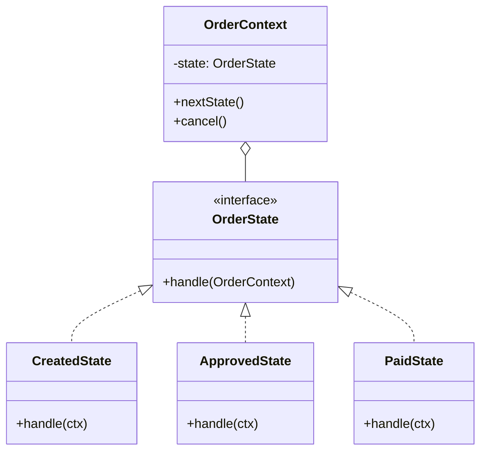
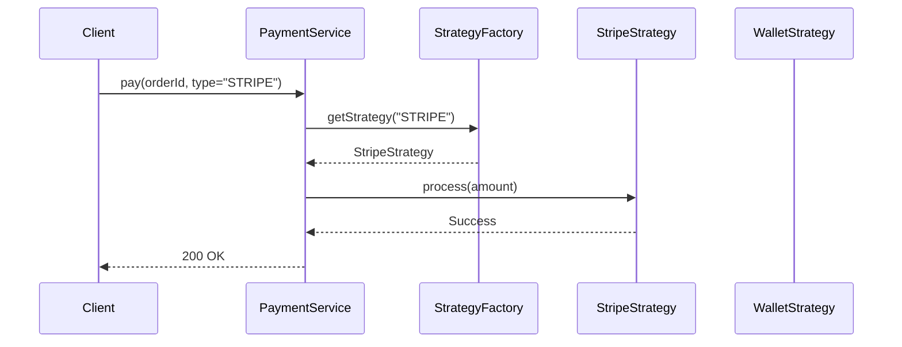

# 01. Object-Oriented Design (OOD) & Design Patterns Deep Dive

**Context:** RetailHub (B2B SaaS, Spring Boot, Microservices)  
**Focus:** State, Strategy, Repository, Orchestrator Patterns  
**Role:** Backend Engineer / Architect

---

## 1. Executive Overview
In a complex microservices architecture like RetailHub, **Object-Oriented Design (OOD)** is not just about classes and objects; it's about managing complexity and dependencies. A robust implementation of design patterns ensures that services like **OMS (Order Management Service)** and **Payment Service** remain maintainable, testable, and extensible as business rules evolve.

Poor OOD leads to "Anemic Domain Models" (where logic lives in Services, and Entities are just data holders) or "Spaghetti Code" (massive if-else chains). This guide enforces **Rich Domain Models** and standard behavioral patterns to solve specific RetailHub challenges like Order Lifecycle and Multi-Provider Payments.

---

## 2. Basics: Core Concepts & Glossary

### 2.1 The Big Three Principles
1.  **Encapsulation:** interacting with an `Order` object through methods (`approve()`, `ship()`), not direct field access.
2.  **Polymorphism:** `PaymentStrategy` interface allows swapping `Stripe` for `PayPal` without changing the `CheckoutService`.
3.  **Inheritance vs. Composition:** Favor composition. An `Order` *has* a `PaymentMethod`, it doesn't *inherit* from it.

### 2.2 Glossary
-   **Anemic Model:** Anti-pattern. Entities are just getters/setters. Logic is in "Service" classes.
-   **Rich Model:** Entities contain business logic (e.g., `order.calculateTotal()`).
-   **DTO (Data Transfer Object):** Dumb objects for moving data between layers (API <-> Service).
-   **Entity:** Identity-based object (e.g., User, Order).

---

## 3. Intermediate: Patterns in RetailHub

### 3.1 State Pattern (Behavioral)
**Use Case:** Managing the `Order` lifecycle in OMS. An order transitions from `CREATED` -> `APPROVED` -> `PAID` -> `SHIPPED`.
-   **Why:** Eliminates massive `switch` or `if-else` blocks checks in the Service layer.
-   **How:** Each state is a class implementing a common interface.

### 3.2 Strategy Pattern (Behavioral)
**Use Case:** Processing payments in the Payment Service.
-   **Why:** We need to support Wallet, Credit Card (Stripe), and PayPal. New methods shouldn't break existing code.
-   **How:** `PaymentProcessor` interface with multiple implementations.

### 3.3 Repository Pattern (Structural/Architectural)
**Use Case:** Abstraction of Data Access in all services (CRM, Inventory).
-   **Why:** Business logic shouldn't know if we are using H2, PostgreSQL, or Mongo.
-   **How:** Spring Data JPA `JpaRepository`.

### 3.4 Orchestrator Pattern (Architectural)
**Use Case:** Coordinating the "Checkout" Saga in OMS.
-   **Why:** Ensures atomic-like operations across Microservices (Inventory Reserve -> Payment Charge -> Notify).
-   **How:** A central `SagaOrchestrator` service that manages the sequence and compensating transactions.

---

## 4. Advanced: Scaling & Reliability

### 4.1 Stateless vs Stateful Design
While we use the **State Pattern** inside the code, the microservices themselves must be **Stateless**. The state is persisted in the DB (PostgreSQL).
-   **Challenge:** Concurrency. Two users updating the same order.
-   **Solution:** Optimistic Locking (`@Version`).

### 4.2 Handling "God Classes"
The `Order` class often becomes a "God Class" with 50+ fields.
-   **Refactoring:** Break it down using **Value Objects**.
    -   Instead of `String street, city, zip`, use `Address shippingAddress`.
    -   Instead of `BigDecimal amount, String currency`, use `Money total`.

---

## 5. Architecture Visuals

### 5.1 State Pattern Class Diagram (OMS)


### 5.2 Strategy Pattern Sequence (Payment)


---

## 6. Code & Config Examples

### 6.1 State Pattern Implementation (Java)
```java
// 1. Context
@Entity
public class Order {
    @Id
    private Long id;
    
    @Convert(converter = StateConverter.class)
    private OrderState state = new CreatedState(); 
    
    public void next() {
        this.state.next(this);
    }
}

// 2. Interface
public interface OrderState {
    void next(Order context);
}

// 3. Concrete State
public class CreatedState implements OrderState {
    @Override
    public void next(Order context) {
        // Business Rule: Can only potentially go to APPROVED
        if (context.isValid()) {
             context.setState(new ApprovedState());
        }
    }
}
```

### 6.2 Strategy Pattern (Spring Boot)
```java
// Interface
public interface PaymentStrategy {
    boolean pay(BigDecimal amount);
    PaymentType getType();
}

// Implementation
@Component
public class StripePaymentStrategy implements PaymentStrategy {
    public boolean pay(BigDecimal amount) { /* Call Stripe API */ return true; }
    public PaymentType getType() { return PaymentType.STRIPE; }
}

// Factory / Context
@Service
public class PaymentService {
    private final Map<PaymentType, PaymentStrategy> strategies;

    @Autowired // Auto-injects all implementations into a List
    public PaymentService(List<PaymentStrategy> stratList) {
        this.strategies = stratList.stream()
            .collect(Collectors.toMap(PaymentStrategy::getType, Function.identity()));
    }

    public void process(PaymentType type, BigDecimal amount) {
        strategies.get(type).pay(amount);
    }
}
```

---

## 7. Operational Playbook

### 7.1 Monitoring Design patterns
-   **Strategy:** Log which strategies are used most (e.g., `Log: PaymentMethod=STRIPE`). Alert if one strategy has 100% failure rate (e.g., Stripe API is down).
-   **State:** Monitor "Stuck" states. Alert if `Order` remains in `PAYMENT_PENDING` > 1 hour.

### 7.2 Common Incidents
-   **Incident:** `NullPointerException` in Factory.
    -   *Cause:* User requested a payment type that implementation is missing for.
    -   *Fix:* Add `default` case or throw `InvalidPaymentMethodException`.

---

## 8. Security & Compliance Notes

-   **State Pattern:** Ensure `next()` transitions verify authorization. A `CUSTOMER` cannot trigger a transition from `PAID` -> `SHIPPED` (Only `LOGISTICS_WORKER` can).
-   **Strategy:** When using External Payment Strategies, ensuring **PCI-DSS** compliance. Never log full credit card numbers in the strategy implementation.

---

## 9. Interview Prep

### 9.1 Common Questions
1.  **Q:** Why use State pattern instead of Enums with switch case?
    -   *A:* OCP (Open-Closed Principle). Adding a new state (e.g., `RETURNED`) in State pattern means adding a new class. In Switch case, you must modify the core logic file, risking regressions.
2.  **Q:** Explain the difference between Strategy and Factory patterns.
    -   *A:* Factory creates objects (Structural/Creational). Strategy selects behavior at runtime (Behavioral). They are often used together (Factory creates the Strategy).

### 9.2 Whiteboard Prompt
*"Design a tiered discount system for RetailHub where VIPs get 10% off and Wholesalers get bulk discounts."*
-   **Solution:** Use **Strategy Pattern** (`DiscountStrategy`). Implement `VipDiscount` and `BulkDiscount`.

---

## 10. Practice Exercises

1.  **Basic:** Implement a `ShippingStrategy` (FedEx, UPS, DHL) that calculates cost based on weight.
2.  **Intermediate:** Refactor the `Order` entity in `oms-service` to use the **State Pattern** for `PENDING` -> `CONFIRMED`.
3.  **Advanced:** Implement an **Orchestrator** using Spring Events that listens to `OrderCreatedEvent` and triggers `InventoryReserveCommand`.

---

## 11. Checklists

### Production Readiness
- [ ] **State Immutability:** Are state transitions atomic and thread-safe?
- [ ] **Dependency Injection:** Are Strategies injected via Spring context?
- [ ] **Validation:** Do Value Objects enforce their own consistency (e.g., Money cannot be negative)?
- [ ] **Testing:** Unit tests cover every concrete State and Strategy class.

---

## 12. References
-   *Design Patterns: Elements of Reusable Object-Oriented Software* (GoF)
-   *Clean Architecture* via Robert C. Martin
-   *Spring Framework Documentation* (Core Technologies > Beans)
