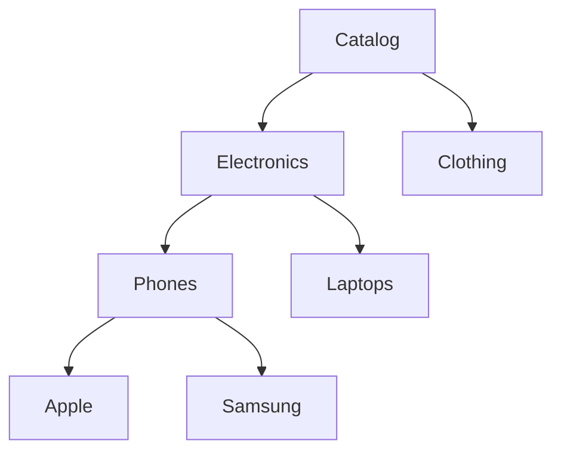

# 02. DSA for Backend Systems Deep Dive

**Context:** RetailHub (High-Throughput E-Commerce)  
**Focus:** Queues, Maps, Trees, Graphs, Heaps, Complexity Analysis  
**Role:** Backend Engineer / Performance Specialist

---

## 1. Executive Overview
In Backend Engineering, Data Structures and Algorithms (DSA) effectively determine the **Scalability** and **Latency** of your services. For RetailHub, choosing the wrong data structure for the "Checkout Hot Path" or "Inventory Check" can cause outages during peak traffic (Black Friday). This guide connects abstract CS concepts to concrete production scenarios in Spring Boot and Kafka.

---

## 2. Basics: Core Concepts & Glossary

### 2.1 The Big O Notation (Time Complexity)
-   **O(1) - Constant:** Hash Map / Redis lookup. (Goal for Inventory Check).
-   **O(log N) - Logarithmic:** Binary Search / Database B-Tree Index. (Goal for Order Lookup).
-   **O(N) - Linear:** Scanning a non-indexed table column. (Avoid on hot paths).
-   **O(N^2) - Quadratic:** Nested loops. (Forbidden in request threads).

### 2.2 Mental Models
-   **Queue:** FIFO buffer. Decouples fast producers (Checkout) from slow consumers (Shipping).
-   **Stack:** LIFO. Used in recursion/DFS (e.g., Category Tree traversal).
-   **Map (Hash Table):** Key-Value store. Caching user sessions.
-   **Graph:** Relationships. Recommendation engines (Users who bought X also bought Y).

---

## 3. Intermediate: Structures in RetailHub

### 3.1 Linear Structures: Queues & Lists
-   **Kafka Log (Queue-like):** We use Kafka Partitions as distributed, persistent logs.
    -   *Scenario:* `order-placed` events.
    -   *Key:* Partitioning Key (TenantID) ensures strict ordering per tenant.
-   **ArrayList vs LinkedList:**
    -   *Usage:* In-memory cart items. `ArrayList` favored for cache locality. `LinkedList` almost never used due to poor CPU caching.

### 3.2 Maps & Hashing
-   **Java `ConcurrentHashMap`:** Used for local caching of frequently accessed config flags.
-   **Redis (Distributed Map):** Stores active User Sessions (JWTs).
    -   *Collision:* Redis handles this internally, but keys must be carefully named (`tenant:user:id`).

### 3.3 Trees: Hierarchy
-   **Product Categories:** "Electronics -> Phones -> Apple".
    -   *Structure:* N-ary Tree.
    -   *DB Implementation:* "Adjacency List" or "Closure Table" pattern in SQL.
-   **B-Trees (Databases):** All Primary Keys in PostgreSQL use B-Tree indexes for O(log N) lookups.

---

## 4. Advanced: Specialized Algorithms

### 4.1 Priority Queues (Heaps)
**Scenario:** Handling "VIP Orders" first during limited stock availability.
-   **Structure:** Min-Heap or Max-Heap.
-   **Implementation:** `PriorityBlockingQueue` in Java or RabbitMQ Priority Queues.
-   **Complexity:** Insert O(log N), Extract O(log N).

### 4.2 Graphs & Recommendations
**Scenario:** "People who viewed this item also viewed..."
-   **Structure:** Adjacency Matrix or Graph Database (Neo4j).
-   **Algorithm:** Breadth-First Search (BFS) to find neighbors of neighbors.

### 4.3 Rate Limiting (Token Bucket)
**Scenario:** API Gateway throttling 100 req/sec.
-   **Algorithm:** Token Bucket or Leaky Bucket.
-   **Complexity:** O(1) per request to check & decrement token count.

---

## 5. Architecture Visuals

### 5.1 Kafka Partitioning (Queue)
```mermaid
graph TD
    P[Producer: OMS] -->|Key: Tenant-A| Part1[Partition 1]
    P -->|Key: Tenant-B| Part2[Partition 2]
    P -->|Key: Tenant-C| Part1
    
    Part1 --> C1[Consumer Instance 1]
    Part2 --> C2[Consumer Instance 2]
    
    note using "Key" ensures Tenant-A orders are strictly ordered
```

### 5.2 Category Tree Traversal (DFS/Recursion)


---

## 6. Code & Config Examples

### 6.1 Priority Queue in Java
```java
// Comparator for VIP processing
Comparator<Order> orderComparator = Comparator.comparing(Order::isVip).reversed()
    .thenComparing(Order::getTimestamp);

// Initializing Queue
BlockingQueue<Order> processingQueue = new PriorityBlockingQueue<>(100, orderComparator);

// Producer
processingQueue.offer(new Order("id1", false)); // Standard
processingQueue.offer(new Order("id2", true));  // VIP (Will jump ahead)

// Consumer
Order next = processingQueue.take(); // Returns id2 (VIP)
```

### 6.2 Simple Rate Limiter (Token Bucket)
```java
public class SimpleRateLimiter {
    private final int capacity;
    private int tokens;
    private long lastRefillTime;

    public synchronized boolean tryConsume() {
        refill();
        if (tokens > 0) {
            tokens--;
            return true;
        }
        return false;
    }

    private void refill() {
        long now = System.currentTimeMillis();
        // Add 1 token per second
        int newTokens = (int) ((now - lastRefillTime) / 1000);
        if (newTokens > 0) {
            tokens = Math.min(capacity, tokens + newTokens);
            lastRefillTime = now;
        }
    }
}
```

---

## 7. Operational Playbook

### 7.1 Hot-Spot Detection
-   **Symptom:** High CPU usage on Inventory Service.
-   **Cause:** Scanning a `List` of 100,000 SKUs instead of using a `Map`.
-   **Fix:** Change data structure to `Map` for O(1) access.

### 7.2 Memory Leaks
-   **Symptom:** `OutOfMemoryError`.
-   **Cause:** Using a `static Map` as a cache without eviction policy (unbounded growth).
-   **Fix:** Use `Caffeine` or `Guava Cache` with `maximumSize` and `expireAfterWrite`.

---

## 8. Security & Compliance Notes

-   **Algorithmic Complexity Attacks:**
    -   *Attack:* Sending JSON with thousands of deeply nested objects (Stack Overflow via Recursion).
    -   *Mitigation:* Limit recursion depth and request payload size in Spring Security.
    -   *Attack:* Hash Collision Denial of Service (DoS).
    -   *Mitigation:* Java uses Balanced Trees for HashMaps with many collisions (since Java 8), mitigating this worst-case O(N) to O(log N).

---

## 9. Interview Prep

### 9.1 Common Questions
1.  **Q:** When would you use a LinkedList over an ArrayList?
    -   *A:* Almost never in modern systems due to cache misses. Exception: If you need O(1) removal from the *head* (Queue implementation) and don't care about random access.
2.  **Q:** How does Redis achieve O(1) performance?
    -   *A:* It uses an in-memory Hash Table. Chains usage for collisions.

### 9.2 Whiteboard Prompt
*"Design an in-memory cache with Least Recently Used (LRU) eviction policy."*
-   **Solution:** Use `HashMap` + `DoublyLinkedList`.
    -   Map stores Key -> Node.
    -   List maintains order.
    -   Accessing a node moves it to the head (Most Recently Used).
    -   Eviction removes tail (Least Recently Used).
    -   (Java has `LinkedHashMap` for this).

---

## 10. Practice Exercises

1.  **Basic:** Write a routine to traverse a Product Category tree and list all "Leaf" nodes (Concrete products).
2.  **Intermediate:** Implement a `CircularBuffer` for storing the last 100 user actions for a specialized audit log.
3.  **Advanced:** Optimize a "Search" function that currently scans all 50,000 products (O(N)) to use a Trie (Prefix Tree) for auto-complete (O(L) where L is word length).

---

## 11. Checklists

### Performance Hygiene
- [ ] ** Loops:** Are there any nested loops `O(N^2)` in the critical path?
- [ ] **DB Indexes:** Are all `WHERE` clauses covered by B-Tree or Hash indexes?
- [ ] **Collections:** Are default capacities set to avoid resizing overhead? (e.g., `new ArrayList(10000)`).
- [ ] **Streams:** Are parallel streams used correctly (CPU bound) vs sequential (IO bound)?

---

## 12. References
-   *Introduction to Algorithms (CLRS)*
-   *Effective Java* (Item: Favor standard libraries)
-   *Cracking the Coding Interview* (Big O Chapter)
