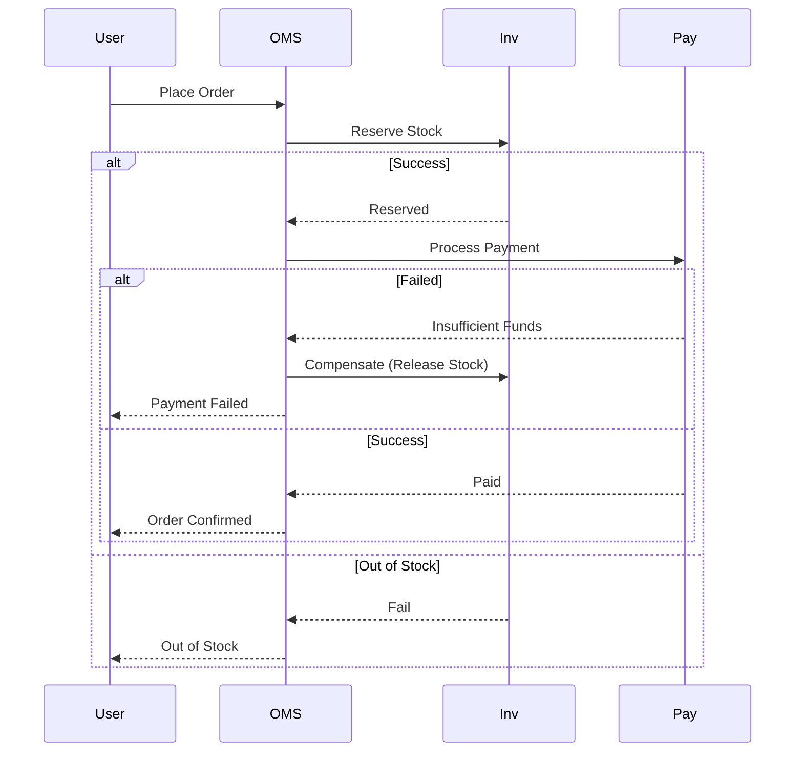

# 03. System Design Fundamentals Deep Dive

**Context:** RetailHub (SaaS Platform)  
**Focus:** Scalability, CAP Theorem, Partitioning, Caching, CQRS, Saga  
**Role:** Principal Architect

---

## 1. Executive Overview
System Design is the art of balancing **trade-offs**. For RetailHub, we prioritize **Availability** and **Latency** for the Storefront (Browsing), but we prioritize **Consistency** for Inventory and Payments. Understanding these axes (CAP Theorem) prevents us from building "one-size-fits-all" systems that fail at scale. This guide formalizes our architectural decisions.

---

## 2. Basics: Core Concepts & Glossary

### 2.1 The CAP Theorem
-   **Consistency (C):** Every read receives the most recent write. (Critical for: Inventory Count).
-   **Availability (A):** Every request receives a (non-error) response. (Critical for: Product Search).
-   **Partition Tolerance (P):** The system continues to operate despite network messages dropping. (Non-negotiable in distributed systems).
-   **RetailHub Strategy:** CP for Inventory/Payment. AP for Catalog/Reviews.

### 2.2 Scalability (Vertical vs. Horizontal)
-   **Vertical (Scale Up):** Bigger CPU/RAM. (Easier, but has limits).
-   **Horizontal (Scale Out):** More instances. (RetailHub's approach: Add more OMS pods).

### 2.3 ACID vs BASE
-   **ACID (Atomicity, Consistency, Isolation, Durability):** SQL Transactions.
-   **BASE (Basically Available, Soft state, Eventual consistency):** NoSQL / Message Queues.

---

## 3. Intermediate: Patterns in RetailHub

### 3.1 Database Partitioning (Sharding)
**Scenario:** `Orders` table growing to 1 Billion rows.
-   **Strategy:** Partition by `TenantID` or `TimeRange`.
-   **Trade-off:** Cross-partition queries become expensive (e.g., "Find all orders from all tenants").

### 3.2 Caching Strategies
**Scenario:** Reducing load on Product DB.
-   **Cache-Aside (Lazy Loading):** App checks Cache -> Miss -> DB -> Update Cache. (Used in RetailHub).
-   **Write-Through:** App updates Cache -> Cache updates DB. (Slower writes, safer data).
-   **TTL (Time To Live):** Essential to prevent stale data.

### 3.3 CQRS (Command Query Responsibility Segregation)
**Scenario:** Optimization of Read vs Write models.
-   **Command (Write):** `CreateOrder` (Complex validation, normalized 3NF DB).
-   **Query (Read):** `GetOrderHistory` (Fast, denormalized view, strictly optimized for UI).
-   *RetailHub:* Separation of `oms-service` (Write) and `analytics-service` (Read).

---

## 4. Advanced: Distributed Consistency

### 4.1 The Saga Pattern
**Problem:** Distributed Transaction across Inventory, Payment, and Shipping. 2-Phase Commit (2PC) is too slow/locking.
-   **Solution (Saga):** Sequence of local transactions.
    -   *Step 1:* Reserve Request (Inventory).
    -   *Step 2:* Charge (Payment).
    -   *Step 3:* Ship (Shipping).
-   **Compensation:** If Step 2 fails, trigger `Release Stock` (Undo Step 1).

### 4.2 Idempotency
**Problem:** Network timeout causes Client to retry `POST /checkout`. We must not charge twice.
-   **Solution:** Idempotency Keys. Client sends `X-Request-ID: unique-uuid`. Server stores this ID and returns cached response if seen again.

---

## 5. Architecture Visuals

### 5.1 Saga Orchestration (Checkout)


### 5.2 CQRS Architecture
```mermaid
graph TD
    Client -->|Write: Place Order| CMD[Command Model (OMS)]
    Client -->|Read: View History| QRY[Query Model (Analytics)]
    
    CMD --> DB1[(Write DB: PostgreSQL)]
    DB1 -->|CDC / Kafka Events| Projector[Event Projector]
    Projector --> DB2[(Read DB: Elastic/Mongo)]
    
    QRY --> DB2
```

---

## 6. Code & Config Examples

### 6.1 Idempotency Check (Java Pseudo-code)
```java
@PostMapping("/checkout")
public ResponseEntity<?> checkout(@RequestHeader("Idempotency-Key") String key) {
    // 1. Check Redis
    if (redis.exists(key)) {
        return redis.get(key); // Return previous response
    }

    // 2. Process (Atomic)
    Order order = orderService.create();

    // 3. Save Result
    redis.set(key, order, TTL_24H);

    return ResponseEntity.ok(order);
}
```

### 6.2 Saga Step Definition (Spring State Machine logic)
```java
public void onPaymentFailed(Order order) {
    // Compensating Action
    inventoryClient.releaseStock(order.getSku(), order.getQty());
    order.setStatus(OrderStatus.CANCELLED);
    repository.save(order);
}
```

---

## 7. Operational Playbook

### 7.1 Handling "Split Brain"
-   **Scenario:** Network partition separates Kafka nodes.
-   **Strategy:** Ensure `min.insync.replicas` is set strictly (CP) to prevent data loss, even if it means rejecting writes (Availability loss).

### 7.2 Cache Stampede (Thundering Herd)
-   **Scenario:** Cache expires, 10,000 users hit DB simultaneously.
-   **Fix:** "Probabilistic Early Expiration" or Locking. Only allow 1 thread to recompute cache.

---

## 8. Security & Compliance Notes

-   **Data Residency:** Sharding strategy must respect laws (e.g., EU data stays in EU shards).
-   **Sync vs Async:** Don't process PII in async logs if possible to avoid massive "Right to erasure" cleanup headaches in Kafka retention.

---

## 9. Interview Prep

### 9.1 Common Questions
1.  **Q:** Design Twitter. (Feed vs Posting).
    -   *A:* Posting is Write-Heavy (Fanout on Write). Feed is Read-Heavy. Use similar concepts: Pre-computed feeds (CQRS).
2.  **Q:** What is consistent hashing?
    -   *A:* A distribution scheme that minimizes reorganization of data when nodes are added/removed. Essential for Distributed Caches (Redis Cluster).

### 9.2 Whiteboard Prompt
*"Design a flash-sale system where 1,000 iPhones are sold to 1 Million users in 5 seconds."*
-   **Solution:** 
    -   Redis counter `DECR` (Atomic).
    -   Queue requests (Kafka) to process asynchronously.
    -   Rate limiter to protect DB.

---

## 10. Practice Exercises

1.  **Basic:** Implement a basic **Cache-Aside** pattern using a `Map` and a simulated DB delay.
2.  **Intermediate:** Design a **URL Shortener** schema. Discuss 62-base encoding vs UUIDs.
3.  **Advanced:** Implement a **Distributed Lock** using Redis (`SETNX`) to prevent two instances of a Cron job from running simultaneously.

---

## 11. Checklists

### System Design Review
- [ ] **SPOF:** Single Points of Failure identified? (e.g., One Master node).
- [ ] **Bottlenecks:** Where is the slowest link? (DB Disk I/O, Network Bandwidth).
- [ ] **Scaling:** Can we double capacity by just adding nodes? (Statelessness).
- [ ] **Recovery:** If Redis is flushed, does the DB survive the hit?

---

## 12. Expert Corner: Battle-Tested Nuances

### 12.1 Load Shedding (Server-Side)
When the server is at 100% CPU, adding requests to a queue just increases latency for everyone.
-   **Strategy:** Fail Fast. If queue size > 50, return `503 Service Unavailable` immediately.
-   **Config:** Tomcat `max-swallow-size`.

### 12.2 Shuffle Sharding (Blast Radius Reduction)
-   **Problem:** If Tenant A (Huge) crashes the "Shared Database 1", it kills Tenant B and C who share that DB.
-   **Solution:** Assign resources randomly.
    -   Tenant A uses DB 1 & 2.
    -   Tenant B uses DB 2 & 3.
    -   Tenant C uses DB 1 & 3.
-   **Result:** A crash on DB 1 affects A & C, but B survives. It limits the "Blast Radius".

## 13. References
-   *Designing Data-Intensive Applications* (The Bible of System Design)
-   *Microservices Patterns* (Chris Richardson)
-   *Site Reliability Engineering* (Google)
