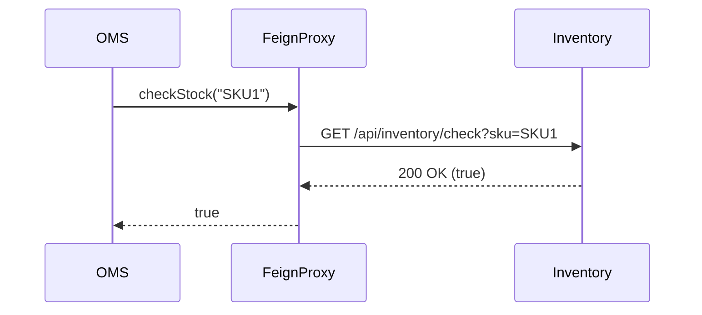

# 04. Spring Boot Microservices Deep Dive

**Context:** RetailHub (Java Component Stack)  
**Focus:** Core Annotations, Feign Clients, Actuator, Profiles  
**Role:** Backend Developer

---

## 1. Executive Overview
Spring Boot is the "Operating System" of RetailHub's backend. It favors **Convention over Configuration**, allowing us to spin up production-ready services (OMS, CRM) in minutes. However, "Magic" can be dangerous. This guide peels back the layers of auto-configuration, dependency injection, and distributed communication to ensure we build robust, predictable microservices.

---

## 2. Basics: Core Concepts & Glossary

### 2.1 The Spring Container (IoC)
-   **Inversion of Control (IoC):** You don't create objects (`new Service()`). You ask Spring for them.
-   **Bean:** An object managed by Spring. Singleton by default.
-   **Auto-Configuration:** Spring guesses what you need. (e.g., "I see `H2` on the classpath, so I'll create a DataSource bean").

### 2.2 Stereotype Annotations
-   `@RestController`: Handles HTTP requests. Returns JSON.
-   `@Service`: Business logic. Transactional boundaries often sit here.
-   `@Repository`: Data Access. Translates DB exceptions.
-   `@Component`: Generic bean.

---

## 3. Intermediate: Communication & Config

### 3.1 Synchronous Communication (Feign)
**Goal:** OMS needs to ask Inventory "Is Item X in stock?".
-   **RestTemplate:** Old school. Verbose.
-   **OpenFeign:** Declarative. Write an interface, Spring generates the implementation.
    -   *RetailHub Standard:* Use Feign for all internal sync calls.

### 3.2 Profiles & Properties
**Goal:** Different settings for `dev` (H2 DB) vs `prod` (PostgreSQL).
-   `application.yml`: Default settings.
-   `application-prod.yml`: Overrides.
-   **Activation:** `-Dspring.profiles.active=prod`.

### 3.3 Observability (Actuator)
**Goal:** Health checks and metrics.
-   `/actuator/health`: "Am I alive?" (Used by K8s).
-   `/actuator/metrics`: "CPU usage, JVM heap".
-   *Security:* Expose only necessary endpoints securely.

---

## 4. Advanced: Deep Customization

### 4.1 Conditional Beans
**Scenario:** Create a distinct `Bean` only if a property exists.
-   `@ConditionalOnProperty(name = "features.new-cart", havingValue = "true")`
-   Used for **Feature Flags**.

### 4.2 Custom Starters
**Scenario:** Shared logic for JWT Validation across all 5 services.
-   **Solution:** Create a `retailhub-common-starter` library.
-   **Auto-Config:** `spring.factories` or `org.springframework.boot.autoconfigure.AutoConfiguration.imports`.

---

## 5. Architecture Visuals

### 5.1 Bean Lifecycle
```mermaid
graph TD
    Start[App Start] --> Scan[Component Scan]
    Scan --> Inst[Instantiate Beans]
    Inst --> DI[Dependency Injection]
    DI --> PostInit[@PostConstruct]
    PostInit --> Ready[Ready for Requests]
    Ready --> Shutdown[App Shutdown]
    Shutdown --> PreDestroy[@PreDestroy]
```

### 5.2 Feign Client Flow


---

## 6. Code & Config Examples

### 6.1 Feign Client (Declarative)
```java
@FeignClient(name = "inventory-service", fallback = InventoryFallback.class)
public interface InventoryClient {
    
    @GetMapping("/api/inventory/{sku}")
    InventoryDto getStock(@PathVariable("sku") String sku);
}

@Component
class InventoryFallback implements InventoryClient {
    public InventoryDto getStock(String sku) {
        return new InventoryDto(sku, 0); // Default: Out of stock
    }
}
```

### 6.2 Service Layer Transaction
```java
@Service
@RequiredArgsConstructor // Lombok constructor injection
public class OrderService {
    
    private final OrderRepository repo;
    private final InventoryClient inventory;

    @Transactional // Database Transaction
    public Order create(OrderReq req) {
        // 1. Remote Call
        var stock = inventory.getStock(req.getSku());
        
        // 2. Local Logic
        var order = new Order(req);
        return repo.save(order);
    }
}
```

---

## 7. Operational Playbook

### 7.1 Debugging "Auto-Config Hell"
-   **Symptom:** "Bean not found" or unexpected behavior.
-   **Tool:** Run with `--debug`. Spring prints a "Condition Evaluation Report".
    -   *Positive Matches:* What matched and why.
    -   *Negative Matches:* What didn't match and why.

### 7.2 Memory Tuning
-   **Issue:** Microservice OOM.
-   **Fix:** Spring Boot apps effectively need `-Xmx` (Heap) set to 70-80% of Container Limit.

---

## 8. Security & Compliance Notes

-   **Actuator Exposure:** NEVER expose `/env` or `/heapdump` publicly. It leaks passwords.
    -   *Config:* `management.endpoints.web.exposure.include=health,info,prometheus`
-   **Dependency Scanning:** Use Maven `dependency-check` to find vulnerabilities in Transitive Dependencies (Log4j scenario).

---

## 9. Interview Prep

### 9.1 Common Questions
1.  **Q:** `@Autowired` vs Constructor Injection?
    -   *A:* Constructor Injection is preferred. It makes testing easier (no Reflection needed), ensures immutability (`final` fields), and prevents circular dependencies at compile/startup time.
2.  **Q:** How does `@Transactional` work?
    -   *A:* It uses AOP (Aspect Oriented Programming) to create a **Proxy**. The proxy starts the transaction, runs your method, and commits (or rollbacks on RuntimeException).

### 9.2 Whiteboard Prompt
*"Draw the request flow from a Controller to the Database."*
-   *Diagram:* Controller (DTO -> Domain) -> Service (Business Logic) -> Repository (JPA/Hibernate) -> DB.

---

## 10. Practice Exercises

1.  **Basic:** Create a REST Endpoint that accepts a generic param and returns "Hello {param}". Access it via `curl`.
2.  **Intermediate:** Configure a `schema.sql` that runs only on H2, and use Flyway for PostgreSQL.
3.  **Advanced:** Write a Custom Annotation `@LogExecutionTime` and an Aspect (`@Aspect`) to log the duration of methods.

---

## 11. Checklists

### New Service Checklist
- [ ] **Lombok:** Is Annotation Processing enabled in IDE?
- [ ] **Health:** Is `/actuator/health` returning `UP`?
- [ ] **Tests:** Are `@SpringBootTest` (Integration) and `@WebMvcTest` (Slice) present?
- [ ] **Docker:** Does the Dockerfile use a multi-stage build (build vs run)?

---

## 12. Expert Corner: Battle-Tested Nuances

### 12.1 Graceful Shutdown
When K8s kills a pod (Rolling Update), it sends SIGTERM. Standard Spring apps kill the JVM immediately, dropping active requests.
-   **Fix:** `server.shutdown=graceful`.
-   **Behavior:** Spring pauses new traffic, waits for active threads to finish (up to 30s), then stops.

### 12.2 Context Caching (Test Speed)
-   **Problem:** Tests take 20 mins.
-   **Cause:** Using `@MockBean` on different beans in different tests dirties the Context, forcing Spring to reboot for every test class.
-   **Fix:** Use Broad Integration Tests (Testcontainers) with the *same* context config, and specialized Slice Tests (`@WebMvcTest`) for controllers.

## 13. References
-   *Spring Boot Reference Documentation*
-   *Pro Spring 5*
-   *Baeldung* (Excellent Tutorials)
