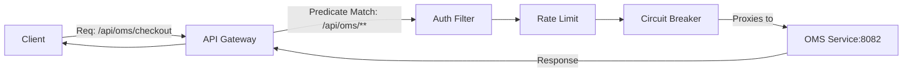

# 05. API Gateway Deep Dive

**Context:** RetailHub (Microservices Entry Point)  
**Focus:** Spring Cloud Gateway, Routing, Filters, Rate Limiting  
**Role:** Platform Engineer

---

## 1. Executive Overview
The **API Gateway** is the "Front Door" of RetailHub. Without it, the React Frontend would need to know the IP address of every service (CRM, OMS, Payment). This is insecure and unscalable. The Gateway provides **Unified Routing**, **Cross-Cutting Concerns** (Auth, Logging), and acts as a shield against traffic spikes.

---

## 2. Basics: Core Concepts & Glossary

### 2.1 Component Model
-   **Route:** The basic building block. Logic: "If path is `/api/oms/**`, send to `http://oms-service`".
-   **Predicate:** The "If" condition. (Matches Path, Method, Header, Host).
-   **Filter:** The "What to do" logic. (Add Header, Strip Prefix, Rate Limit).

### 2.2 Why Spring Cloud Gateway?
-   Built on **Spring WebFlux** (Reactive/Non-blocking).
-   High throughput using **Netty**.
-   Native integration with **Resilience4j**.

---

## 3. Intermediate: Configuration Patterns

### 3.1 Routing Strategies
-   **Path-Based:** `/api/users/` -> `user-service`.
-   **Header-Based:** `X-Canary: true` -> `user-service-beta` (Canary Releases).

### 3.2 Global Filters
**Scenario:** Add a standard Request ID to every log.
-   **GlobalFilter:** Runs for every request.
-   **Correlation ID:** Generate UUID if missing, pass it downstream as `X-Correlation-ID`.

### 3.3 Rate Limiting (Redis-backed)
**Scenario:** Prevent abuse.
-   **Token Bucket:** Allow 10 requests/second per user.
-   **Key Resolver:** Identify user by `Principal` (JWT user) or `RemoteAddress` (IP).

---

## 4. Advanced: Security & resilience

### 4.1 Authentication via Gateway (BFF Pattern)
**Token Relay:** The Gateway validates the JWT (checking signature and expiry) and forwards the parsed claims in headers to downstream services.
-   *Benefit:* Downstream services don't need to parse JWTs, just trust the Gateway (in a private network).

### 4.2 Circuit Breaking at the Edge
**Scenario:** `Review Service` is down.
-   **Behavior:** Instead of timing out (waiting 30s), Gateway returns instant `503 Service Unavailable` or a cached fallback response.

---

## 5. Architecture Visuals

### 5.1 Gateway Routing Logic


---

## 6. Code & Config Examples

### 6.1 `application.yaml` Routing
```yaml
spring:
  cloud:
    gateway:
      routes:
        - id: oms-route
          uri: lb://oms-service  # Load Balanced URI (via Discovery)
          predicates:
            - Path=/api/oms/**
          filters:
            - StripPrefix=2      # /api/oms/x -> /x
            - name: CircuitBreaker
              args:
                name: omsCircuit
                fallbackUri: forward:/fallback/oms
            - name: RequestRateLimiter
              args:
                redis-rate-limiter.replenishRate: 10
                redis-rate-limiter.burstCapacity: 20
```

### 6.2 Custom Global Filter (Logging)
```java
@Component
public class LoggingFilter implements GlobalFilter {
    private static final Logger logger = LoggerFactory.getLogger(LoggingFilter.class);

    @Override
    public Mono<Void> filter(ServerWebExchange exchange, GatewayFilterChain chain) {
        logger.info("Path accessed: {}", exchange.getRequest().getPath());
        
        return chain.filter(exchange).then(Mono.fromRunnable(() -> {
            logger.info("Response Status: {}", exchange.getResponse().getStatusCode());
        }));
    }
}
```

---

## 7. Operational Playbook

### 7.1 "The Gateway is Down"
If the Gateway is down, **nothing** works.
-   **HA Strategy:** Run minimum 3 replicas.
-   **Health Check:** Ensure Load Balancer (AWS ALB) health checks hit `/actuator/health`.

### 7.2 Latency Debugging
-   **Symptom:** Gateway adds 500ms latency.
-   **Checks:**
    -   Are you using blocking code in filters? (e.g., `Thread.sleep` or JDBC). **NEVER** block in WebFlux.
    -   Is Redis (Rate Limiter) slow?

---

## 8. Security & Compliance Notes

-   **CORS (Cross-Origin Resource Sharing):** Configure CORS centrally in Gateway.
    -   *Allow:* `https://retailhub.com`, `https://admin.retailhub.com`.
    -   *Deny:* `*` (Wildcard) in production.
-   **TLS Termination:** Gateway terminates HTTPS. Traffic inside the cluster is HTTP (or mTLS for high security).

---

## 9. Interview Prep

### 9.1 Common Questions
1.  **Q:** Why use an API Gateway instead of direct client-to-service calls?
    -   *A:* Security (hiding internal topology), Protocol Translation (WebSockets -> HTTP), Complexity reduction (client only knows 1 URL).
2.  **Q:** What is the "Backend for Frontend" (BFF) pattern?
    -   *A:* Having specific Gateways for specific clients (e.g., MobileBFF strips data to save bandwidth, WebBFF sends full data).

### 9.2 Whiteboard Prompt
*"Design a system to slowly migrate traffic from `Legacy Monolith` to `New Microservices`."*
-   **Solution:** **Strangler Fig Pattern**.
    -   Configure Gateway.
    -   Route `/api/new-feature` to Microservice.
    -   Route `/**` (Catch-all) to Legacy Monolith.
    -   Gradually implement more routes in Microservices.

---

## 10. Practice Exercises

1.  **Basic:** Set up a Gateway that routes `localhost:8080/google` to `google.com`.
2.  **Intermediate:** Write a Filter that checks for a header `X-Secret-Token`. If missing, return `401`.
3.  **Advanced:** Implement a **Canary Release** route where 10% of traffic goes to `oms-v2` based on a weighted predicate or random number.

---

## 11. Checklists

### Production Launch
- [ ] **Timeouts:** Are connect/read timeouts configured for downstream? (Default is often infinite/long).
- [ ] **Routes:** Are all routes distinct? (Order matters in YAML list).
- [ ] **Rate Limits:** Are limits set for critical, expensive APIs (e.g., Search)?
- [ ] **Logs:** Are access logs enabled (Nginx style)?

---

## 12. References
-   *Spring Cloud Gateway Documentation*
-   *Reactive Programming with Project Reactor*
-   *NIST Microservices Guidelines*
