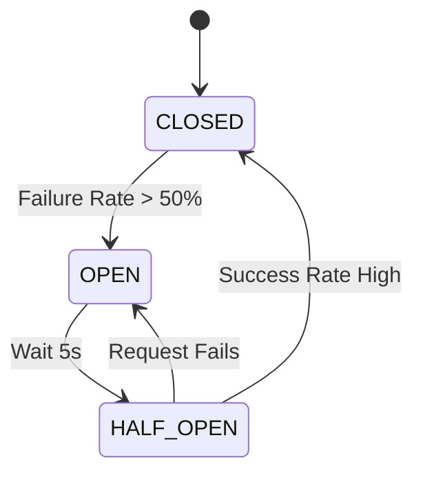

# 06. Resilience4j Deep Dive

**Context:** RetailHub (Fault Tolerance)  
**Focus:** Circuit Breaker, Retry, Bulkhead, Ratelimiter  
**Role:** Reliability Engineer

---

## 1. Executive Overview
In a distributed system like RetailHub, **failures are inevitable**. Network blips, GC pauses, and overloaded databases happen. **Resilience4j** is a lightweight, functional fault tolerance library that ensures a single failing service (e.g., Inventory) doesn't cascade and take down the entire platform (e.g., The Storefront).

---

## 2. Basics: Core Concepts & Glossary

### 2.1 The Circuit Breaker Pattern
System behaves like an electrical circuit breaker.
-   **CLOSED:** Normal operation. Requests flow.
-   **OPEN:** Failure threshold reached (e.g., 50% errors). Requests are blocked immediately (Fail Fast).
-   **HALF-OPEN:** Trial period. Allow a few requests to check if the system recovered.

### 2.2 Other Patterns
-   **Retry:** Try again (good for transient network errors). **Bad** for "Server Overloaded" errors.
-   **Bulkhead:** Limit concurrent calls to a service (e.g., "Only 10 threads for Inventory"). Prevents one service from exhausting all thread pools.
-   **Rate Limiter:** Limit throughput (Req/sec).

---

## 3. Intermediate: Configuration & Tuning

### 3.1 Failure Counting
-   **Count-based:** Last 100 requests.
-   **Time-based:** Last 60 seconds.
-   *RetailHub Config:* Count-based sliding window of size 10 is good for fast reaction in lower traffic.

### 3.2 Exceptions Matter
-   **Record:** `IOException`, `TimeoutException`. (Treat as failure).
-   **Ignore:** `BusinessException` (e.g., "Invalid SKU"). DO NOT open circuit for user errors.

---

## 4. Advanced: Fallback Strategies

### 4.1 Fallback Implementation
What happens when the Circuit opens?
1.  **Fail Silent:** Return `null` or empty list. (Good for "Also Bought" recommendations).
2.  **Stubbed Value:** Return default stock = 0.
3.  **Cache:** Return stale data from Redis.

### 4.2 The "Retry Storm" Anti-Pattern
If 1,000 users retry simultaneously, they will DDoS a recovering service.
-   **Solution:** **Exponential Backoff** with **Jitter** (Randomness).

---

## 5. Architecture Visuals

### 5.1 Circuit Breaker State Machine


---

## 6. Code & Config Examples

### 6.1 `application.yml` Config
```yaml
resilience4j:
  circuitbreaker:
    instances:
      inventoryService:
        registerHealthIndicator: true
        slidingWindowSize: 10
        minimumNumberOfCalls: 5
        failureRateThreshold: 50
        waitDurationInOpenState: 10s
        permittedNumberOfCallsInHalfOpenState: 3
  retry:
    instances:
      inventoryService:
        maxAttempts: 3
        waitDuration: 500ms
        enableExponentialBackoff: true
```

### 6.2 Annotaion Usage (Java)
```java
@Service
public class InventoryClient {

    @CircuitBreaker(name = "inventoryService", fallbackMethod = "fallbackStock")
    @Retry(name = "inventoryService")
    public int getStock(String sku) {
        // Remote call that might fail
        return restTemplate.getForObject("/api/stock/" + sku, Integer.class);
    }

    // Fallback Signature must match original + Exception
    public int fallbackStock(String sku, Exception e) {
        log.warn("Inventory down, returning 0 for " + sku);
        return 0; // Safe default
    }
}
```

---

## 7. Operational Playbook

### 7.1 Monitoring Readiness
-   **Metrics:** Resilience4j exposes Micrometer metrics.
-   **Dashboard:** Graph `resilience4j.circuitbreaker.state` on Grafana.
    -   *Alert:* If State == OPEN for > 5 minutes, page the Inventory Team.

### 7.2 Manual Override
Sometimes automatic recovery fails.
-   **Force Open:** Disable a feature globally.
-   **Force Closed:** Ignore errors (Use with extreme caution).
-   *Actuator Endpoint:* POST `/actuator/circuitbreakers/{name}` (requires Admin rights).

---

## 8. Security & Compliance Notes

-   **Denial of Service (DoS):** Aggressive Retries can be an accidental internal DoS attack. Always limit `maxAttempts`.
-   **Bulkhead Security:** Prevents a compromised/slow downstream service from holding all your connections hostage (Resource Exhaustion).

---

## 9. Interview Prep

### 9.1 Common Questions
1.  **Q:** Why not just increase timeouts?
    -   *A:* Long timeouts tie up threads. If you have 200 threads and all wait 30s, your server becomes unresponsive to *all* requests within seconds. Fail fast is better.
2.  **Q:** Difference between CompletableFuture and Circuit Breaker?
    -   *A:* `CompletableFuture` handles async execution. `CircuitBreaker` handles failure logic / stats. They are complementary.

### 9.2 Whiteboard Prompt
*"Design a system that ensures the 'Buy' button still works even if the 'Review' service is dead."*
-   **Solution:** Service Isolation. The `ProductPage` API calls `Inventory` and `Reviews` in parallel. `Reviews` call is wrapped in a Circuit Breaker with a "Fail Silent" fallback (returning empty list). The `Inventory` (Buy) call is critical and propagates errors.

---

## 10. Practice Exercises

1.  **Basic:** Create a Spring Boot app with a flaky endpoint (fails 50% of time). Wrap it in `@Retry`.
2.  **Intermediate:** Configure a **Bulkhead** so that `service-a` can only make 5 concurrent calls to `service-b`.
3.  **Advanced:** Implement a custom `Predicate` for the Circuit Breaker that only counts `5xx` errors as failures, but ignores `4xx` (Client errors).

---

## 11. Checklists

### Resiliency Audit
- [ ] **Fallbacks:** Do all critical integrations have fallbacks?
- [ ] **Timeouts:** Are HTTP Connect/Read timeouts shorter than the Circuit Breaker timeout?
- [ ] **Thread Pools:** Are Bulkhead pools sized correctly for the machine's cores?

---

## 12. References
-   *Resilience4j Documentation*
-   *Release It! Design and Deploy Production-Ready Software* (Michael Nygard)
