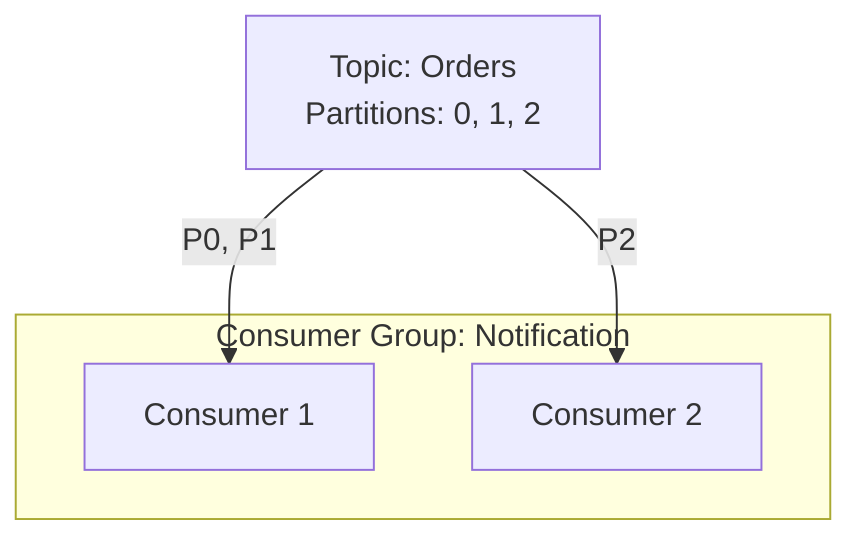

# 07. Apache Kafka Deep Dive

**Context:** RetailHub (Event Driven Architecture)  
**Focus:** Topics, Partitions, Consumer Groups, Idempotency  
**Role:** Data Engineer / Backend Architect

---

## 1. Executive Overview
Kafka is the central nervous system of RetailHub. It decouples services (OMS doesn't call Shipping directly), buffers load (Storefront spikes don't crash Logistics), and provides a persistent history of every business event (`OrderPlaced`, `InventoryReserved`).

---

## 2. Basics: Core Concepts & Glossary

### 2.1 The Log
-   **Topic:** A category of messages (e.g., `orders`, `payments`).
-   **Partition:** A horizontal split of a topic. Unit of parallelism.
-   **Offset:** unique ID of a message in a partition.
-   **Producer:** Sends messages.
-   **Consumer Group:** A team of consumers sharing the workload.

### 2.2 Mental Model
Think of Kafka not as a "Queue" (RabbitMQ) but as a **Distributed Commit Log**. You can "replay" events from yesterday because they aren't deleted immediately after consumption.

---

## 3. Intermediate: RetailHub Patterns

### 3.1 Ordering Guarantees
**Requirement:** `OrderCreated` must be processed before `OrderShipped`.
-   **Solution:** Use same **Partition Key** (`tenantId` or `orderId`) for related events. Kafka guarantees ordering *within a partition*.

### 3.2 Consumer Groups
**Scenario:** `Notification Service` has 3 instances.
-   Topic `orders` has 3 partitions.
-   Each instance grabs 1 partition.
-   *Scaling Limit:* You cannot have more consumers than partitions (extras will sit idle).

### 3.3 DLQ (Dead Letter Queue)
**Scenario:** A message contains corrupt JSON. Consumer crashes loop.
-   **Fix:** After N retries, publish to `orders-dlq` and commit offset. Alert human to inspect.

---

## 4. Advanced: Delivery Semantics

### 4.1 Exactly-Once Semantics (EOS)
**Problem:** Network fail might cause Producer to send duplicate `PaymentDeducted` event.
-   **Idempotent Producer:** `enable.idempotence=true`. Kafka assigns a PID (Producer ID) and de-dupes internally.
-   **Transactional Consumer:** `read_committed` mode.

### 4.2 Schema Evolution (Avro/Registry)
**Problem:** Changing JSON structure breaks downstream.
-   **Solution:** Use **Schema Registry**.
    -   Producer checks schema compatibility (Backward/Forward) before sending.
    -   *RetailHub:* Currently using JSON, planned migration to Avro.

---

## 5. Architecture Visuals

### 5.1 Consumer Group Rebalancing

> **Note:** If C2 dies, P2 moves to C1 (Rebalancing).

---

## 6. Code & Config Examples

### 6.1 `application.yml` (Spring Kafka)
```yaml
spring:
  kafka:
    bootstrap-servers: localhost:9092
    consumer:
      group-id: notification-group
      auto-offset-reset: earliest # Start from beginning if no offset
      enable-auto-commit: false   # Manual ack is safer
    producer:
      key-serializer: org.apache.kafka.common.serialization.StringSerializer
      value-serializer: org.springframework.kafka.support.serializer.JsonSerializer
      properties:
        enable.idempotence: true
```

### 6.2 Retry & DLT (Spring Boot)
```java
@KafkaListener(topics = "orders")
@RetryableTopic(
    attempts = "3",
    backoff = @Backoff(delay = 1000, multiplier = 2.0),
    dltStrategy = DltStrategy.FAIL_ON_ERROR
)
public void listen(OrderEvent event) {
    if (event.getAmount() < 0) throw new RuntimeException("Invalid Amount");
    process(event);
}
```

---

## 7. Operational Playbook

### 7.1 Lag Monitoring
-   **Metric:** `kafka_consumergroup_lag`.
-   **Meaning:** How far behind is Real-time?
-   **Alert:** If lag > 10,000 messages.
-   **Fix:** Scale up Consumer Group (add pods) if partitions allow.

### 7.2 Disk Usage
-   **Risk:** Kafka fills the disk -> Broker crashes.
-   **Retention Policy:** `log.retention.hours=168` (7 days) or `log.retention.bytes=10GB`.

---

## 8. Security & Compliance Notes

-   **Encryption:** Use SSL/TLS (Port 9093) for all traffic.
-   **ACLs:** `NotificationService` should act as Consumer on `orders`, but NOT Producer on `orders`. Principle of Least Privilege.

---

## 9. Interview Prep

### 9.1 Common Questions
1.  **Q:** Kafka vs RabbitMQ?
    -   *A:* RabbitMQ (Smart Broker, Dumb Consumer) pushes messages. Good for complex routing. Kafka (Dumb Broker, Smart Consumer) is pull-based. Good for high throughput and replay.
2.  **Q:** How does Kafka achieve high throughput?
    -   *A:* Sequential Disk I/O (very fast), Zero Copy (OS kernel capability), Batching.

### 9.2 Whiteboard Prompt
*"Design a system to collect click-stream data from 10 Million Users."*
-   **Solution:** Use Kafka.
    -   Producers: JS Client / Beacon API.
    -   Topics: `clicks`, `views`.
    -   Partitioning: By `UserID`.
    -   Consumer: Analytics Aggregator (Spark/Flink).

---

## 10. Practice Exercises

1.  **Basic:** Start Zookeeper & Kafka. Use CLI to produce a message "Hello" and consume it.
2.  **Intermediate:** Write a Java Consumer that uses `Acknowledge` to manually commit offsets only after DB save succeeds.
3.  **Advanced:** Simulate a "Poison Pill" (bad message) and verify it lands in the Dead Letter Topic (DLT).

---

## 11. Checklists

### Production Launch
- [ ] **Replication:** Is `replication.factor` at least 3?
- [ ] **Min ISR:** Is `min.insync.replicas` set to 2? (Ensures durability).
- [ ] **Partitions:** Is partition count high enough for future scaling? (Hard to change later).

---

## 12. Expert Corner: Battle-Tested Nuances

### 12.1 Latency vs. Throughput Tuning
Optimizing Kafka producers requires a trade-off.
-   **Throughput (Batching):** Increase `linger.ms` (e.g., 20ms) and `batch.size` (e.g., 64KB). The producer waits to form a larger bundle. Fewer network packets, higher CPU efficiency.
-   **Latency (Real-time):** Set `linger.ms=0`. Send immediately. Higher network overhead, lowest delay.
-   *RetailHub Decision:* `linger.ms=5` for OMS (Happy medium).

### 12.2 Log Compaction
For entities like **Product Prices**, we don't care about the history of price changes, only the *current* price.
-   **Standard Retention:** Delete old segments after 7 days.
-   **Compaction:** Keep the *latest value* for every Key, delete older value indefinitely.
-   *Config:* `cleanup.policy=compact`.

## 13. References
-   *Kafka: The Definitive Guide* (Confluent)
-   *Spring for Apache Kafka Docs*
