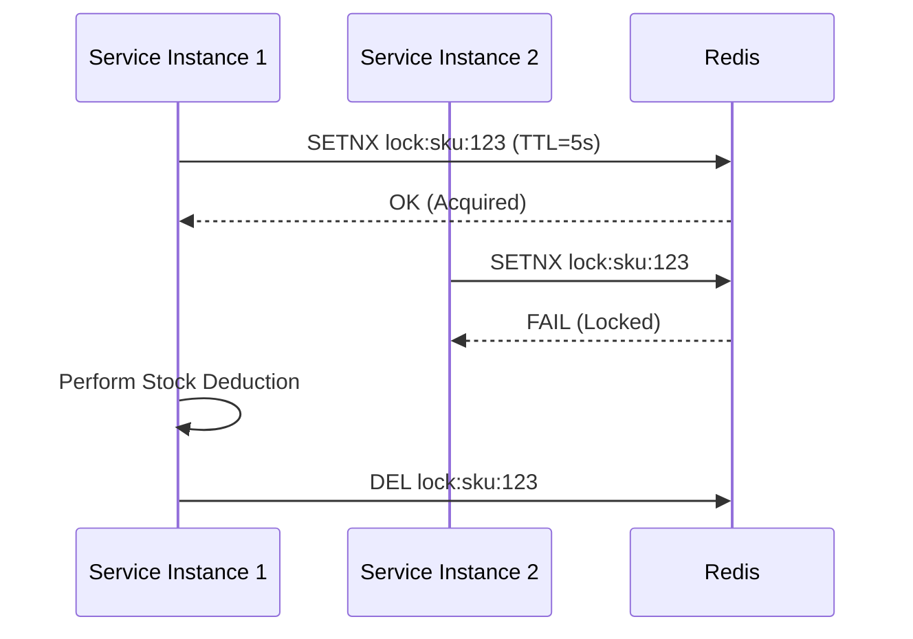

# 08. Redis Deep Dive

**Context:** RetailHub (Caching & Session Store)  
**Focus:** Cache-Aside, TTL, Eviction, Distributed Locks  
**Role:** Backend Engineer

---

## 1. Executive Overview
Redis (Remote Dictionary Server) is RetailHub's "Speed Layer". While PostgreSQL holds the Single Source of Truth, Redis holds the "Hot Data" (Cart sessions, active catalog items). Because it serves data from RAM, it offers sub-millisecond latency.

---

## 2. Basics: Core Concepts & Glossary

### 2.1 Data Structures managed
-   **String:** Simple key-value. (Cached JSON blobs).
-   **List:** Queue. (Simple job queues).
-   **Hash:** Object fields. (User session attributes).
-   **Set:** Unique items. (Active user IDs).
-   **Sorted Set (ZSet):** Leaderboards. (Top selling products).

### 2.2 Persistence
-   **RDB (Snapshot):** Saves DB to disk every X minutes. (Fast restart, potential data loss).
-   **AOF (Append Only File):** Logs every write. (Slower restart, minimal data loss).
-   *RetailHub:* we use RDB for Cache, AOF for Shopping Carts.

---

## 3. Intermediate: Patterns

### 3.1 Cache-Aside Pattern
Standard for `InventoryService`.
1.  App requests SKU-123.
2.  Check Redis.
    -   *Hit:* Return data.
    -   *Miss:* Read DB, Write to Redis (with TTL), Return data.

### 3.2 Write-Through (Alternative)
App writes to Cache, and Cache writes to DB. (Complex to set up, not used in RetailHub V1).

### 3.3 Distributed Locks (Redlock)
**Scenario:** prevent overselling. Two instances try to reserve the last iPhone.
-   Instance 1: `SET resource_name my_random_value NX PX 30000`
-   If OK -> Do work -> Release.
-   If Fail -> Wait/Retry.

---

## 4. Advanced: Production Tuning

### 4.1 Eviction Policies (`maxmemory-policy`)
When Redis is full (e.g., 4GB Limit):
-   **allkeys-lru:** Remove least recently used key (Catalog standard).
-   **volatile-lru:** Remove LRU key *with an expiry set*.
-   **noeviction:** Return error. (For "Carts" - we don't want to delete active carts randomly!).

### 4.2 Thundering Herd
See System Design document. Use "Jitter" in TTLs so 1 million keys don't expire at exactly 12:00:00 PM.

---

## 5. Architecture Visuals

### 5.1 Distributed Lock Flow


---

## 6. Code & Config Examples

### 6.1 Spring Cache Abstraction
```java
@Service
public class ProductService {

    @Cacheable(value = "products", key = "#id", unless = "#result == null")
    public Product getProduct(String id) {
        // This runs only on Cache Miss
        return repo.findById(id).orElse(null);
    }

    @CacheEvict(value = "products", key = "#id")
    public void updateProduct(String id, Product p) {
        repo.save(p);
    }
}
```

### 6.2 Redisson (Distributed Lock)
```java
RLock lock = redisson.getLock("orderLock:" + orderId);
try {
    if (lock.tryLock(1, 10, TimeUnit.SECONDS)) {
        // Critical Section
    }
} finally {
    lock.unlock();
}
```

---

## 7. Operational Playbook

### 7.1 "OOM" (Out Of Memory)
-   **Alert:** Memory usage > 80%.
-   **Fix:**
    -   Verify TTLs are set.
    -   Scale up (Vertical) or Cluster (Horizontal).
    -   Check for "Key Leaks" (Keys with no TTL growing forever).

### 7.2 Latency Spikes
-   **Cause:** Using `KEYS *` command. It is O(N) and blocks the single thread.
-   **Fix:** **NEVER** use `KEYS` in prod. Use `SCAN` (Cursor based).

---

## 8. Security & Compliance Notes

-   **Auth:** Require `requirepass`.
-   **Network:** Redis should **never** be exposed to the public internet. Bind to `10.x.x.x` (Private VPC).
-   **Encryption:** Redis 6.0+ supports TLS.

---

## 9. Interview Prep

### 9.1 Common Questions
1.  **Q:** Redis is single-threaded. How is it so fast?
    -   *A:* In-memory access, non-blocking I/O (Multiplexing), optimized C code. No Context Switching cost.
2.  **Q:** Memcached vs Redis?
    -   *A:* Memcached is multithreaded (horizontal scaling of threads) but only supports Strings. Redis has rich data structures (Sets, Lists).

### 9.2 Whiteboard Prompt
*"Design a 'Recent Views' feature where we show the last 10 items a user looked at."*
-   **Solution:** Redis List.
    -   `LPUSH user:123:views itemID`
    -   `LTRIM user:123:views 0 9` (Keep only top 10)
    -   Complexity: O(1).

---

## 10. Practice Exercises

1.  **Basic:** connect to redis-cli. Set a key with 10s expiry. Watch it disappear.
2.  **Intermediate:** Implement a Counter for "Active Users" using HyperLogLog (Approximate counting, very low memory).
3.  **Advanced:** configure Spring Boot to use Redis for `HttpSession` storage to make your app fully stateless.

---

## 11. Checklists

### Production Launch
- [ ] **Maxmemory:** Is a hard limit set in `redis.conf`?
- [ ] **Backups:** Is RDB/AOF enabled?
- [ ] **Password:** Is Auth enabled?
- [ ] **Slowlog:** Is slowlog configured to catch heavy commands?

---

## 12. Expert Corner: Battle-Tested Nuances

### 12.1 Lua Scripting (Atomicity)
When you need to perform "Check then Set" logic (e.g., "If wallet > 0, decrement"), standard commands have race conditions.
-   **Solution:** Lua scripts run atomically on the Redis server. No other commands run while the script executes.
-   *Example:* `EVAL "if redis.call('get', KEYS[1]) > ARGV[1] then return redis.call('decr', KEYS[1]) else return 0 end" 1 wallet_id 10`

### 12.2 Memory Fragmentation
-   **Symptom:** OS reports Redis using 10GB, but `INFO memory` says 5GB data.
-   **Cause:** Frequent updates/deletes creating "holes" in memory allocator (jemalloc).
-   **Fix:** Enable `activedefrag yes` in `redis.conf` (Redis 4.0+).

## 13. References
-   *Redis Documentation*
-   *Redis in Action*
