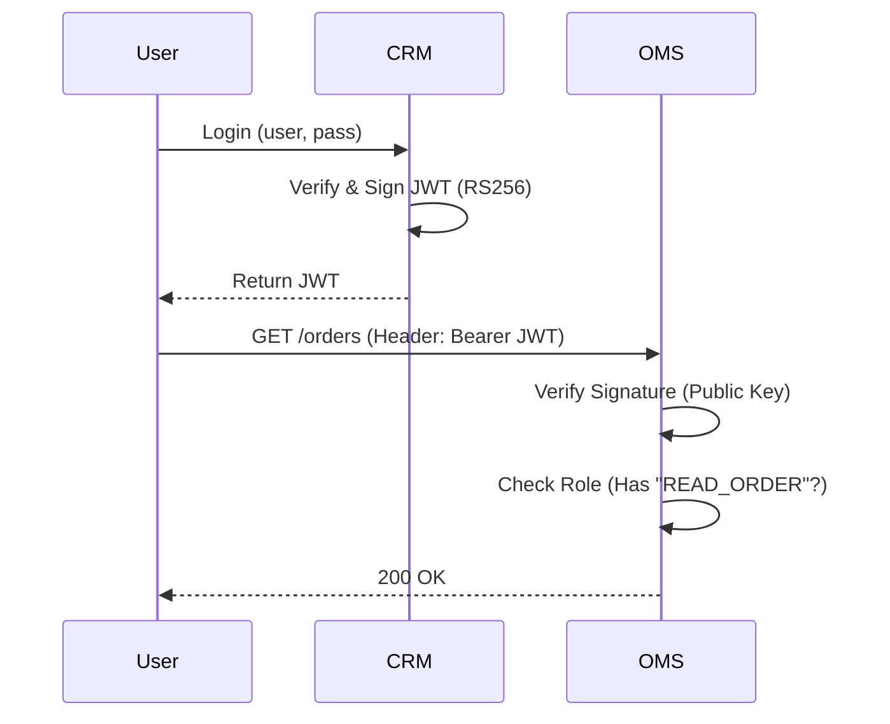

# 10. JWT & RBAC Deep Dive

**Context:** RetailHub (Security)  
**Focus:** Tokens, Claims, Scopes, Multi-Tenancy  
**Role:** Security Architect

---

## 1. Executive Overview
Security in RetailHub is based on **Stateless Authentication**. We do not store sessions in the database (which forces a DB lookup on every request). Instead, we use **JSON Web Tokens (JWT)**—signed "passports" that clients carry. Combined with **Role-Based Access Control (RBAC)**, this secures our multi-tenant capabilities.

---

## 2. Basics: Core Concepts & Glossary

### 2.1 The JWT Structure
A string `aaaaa.bbbbb.ccccc`.
1.  **Header:** Algorithm (`HS256`, `RS256`).
2.  **Payload (Claims):** Data (`sub: user123`, `role: admin`, `tenant: T-1`).
3.  **Signature:** Crypto proof that the payload hasn't been tampered with.

### 2.2 RBAC (Role-Based Access Control)
-   **Role:** Job function (`STORE_MANAGER`).
-   **Permission (Authority):** Specific action (`PRODUCT_UPDATE`).
-   **Mapping:** `STORE_MANAGER` has `PRODUCT_UPDATE` and `ORDER_VIEW`.

---

## 3. Intermediate: RetailHub Implementation

### 3.1 The Auth Flow
1.  User `POST /login` (CRM Service).
2.  CRM verifies password (BCrypt).
3.  CRM generates JWT with Private Key.
4.  User sends JWT in `Authorization: Bearer <token>` header.
5.  Gateway/Service verifies signature with Public Key.

### 3.2 Multi-Tenancy Enforcement
Crucial: **Tenant Isolation**.
-   The JWT contains a custom claim: `tid` (Tenant ID).
-   Every SQL query must filter by this ID.
-   *Anti-Pattern:* Passing tenant ID in URL (Can be manipulated). Trust the Token only.

---

## 4. Advanced: Security Hardening

### 4.1 Symmetric vs Asymmetric Signing
-   **HS256 (Shared Secret):** Fast. But every service needs the secret. If one service is hacked, they can forge tokens for any service.
-   **RS256 (Public/Private Key):** Best. Only Auth Service has Private Key (Signer). Others have Public Key (Verifier). RetailHub uses this.

### 4.2 Refresh Tokens
-   **Access Token:** Short live (15 mins).
-   **Refresh Token:** Long lived (7 days). Stored in HTTPOnly Cookie. Used to get new Access Token.
-   *Revocation:* You can't revoke a JWT! You revoke the Refresh Token in the DB.

---

## 5. Architecture Visuals

### 5.1 Token Journey


---

## 6. Code & Config Examples

### 6.1 JWT Parsing (Spring Security)
```java
public Claims parseToken(String token) {
    return Jwts.parserBuilder()
        .setSigningKey(publicKey)
        .build()
        .parseClaimsJws(token)
        .getBody();
}
```

### 6.2 Method Level Security (RBAC)
```java
@RestController
@RequestMapping("/api/products")
public class ProductController {

    // Only Store Admins can delete
    @PreAuthorize("hasRole('PARTNER_ADMIN')") 
    @DeleteMapping("/{id}")
    public void delete(@PathVariable String id) { 
        service.delete(id); 
    }
    
    // Custom Permission Check
    @PreAuthorize("hasAuthority('PRODUCT_READ')")
    @GetMapping
    public List<Product> list() { ... }
}
```

---

## 7. Operational Playbook

### 7.1 Key Rotation
-   **Scenario:** Private Key compromised.
-   **Action:**
    1.  Generate new Key Pair (Kid: 2).
    2.  Publish new Public Key.
    3.  Sign new tokens with Key 2.
    4.  Accept both Key 1 and Key 2 for 24h.
    5.  Retire Key 1.

---

## 8. Security & Compliance Notes

-   **Sensitive Claims:** NEVER put PII (Social Security Number) in JWT. It is just Base64 encoded, easily readable by anyone.
-   **Algorithm Confusion Attack:** Ensure library forces the expected algorithm (RS256) and doesn't accept "None".

---

## 9. Interview Prep

### 9.1 Common Questions
1.  **Q:** Session vs JWT?
    -   *A:* Session = Server State (Hard to scale). JWT = Client State (Scales well, harder to revoke).
2.  **Q:** Where to store JWT in frontend?
    -   *A:* `localStorage` (Vulnerable to XSS). `HttpOnly Cookie` (Vulnerable to CSRF, but generally safer if SameSite=Strict).

### 9.2 Whiteboard Prompt
*"Design an authorization system where users can grant temporary access to support staff."*
-   **Solution:** OAuth2 / Delegation. "Support" role scopes access to specific Tenant ID for T=1 hour.

---

## 10. Practice Exercises

1.  **Basic:** Decode a JWT using `jwt.io` and identify the breakdown.
2.  **Intermediate:** Configure a Spring Boot filter to reject tokens without a specific `issuer`.
3.  **Advanced:** Implement "Sliding Session" logic using Refresh Tokens.

---

## 11. Checklists

### Security Audit
- [ ] **Expiry:** Is `exp` claim set?
- [ ] **Scope:** Are scopes constrained? (Don't give `TOP_SECRET` by default).
- [ ] **Logging:** Ensure Tokens are **redacted** in logs.

---

## 12. References
-   *RFC 7519 (JSON Web Token)*
-   *OWASP JWT Cheat Sheet*
