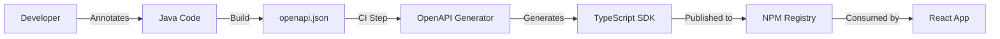

# 11. Swagger / OpenAPI Deep Dive

**Context:** RetailHub (API First Development)  
**Focus:** Spec, Generation, Versioning, Documentation  
**Role:** API Designer

---

## 1. Executive Overview
In a microservices ecosystem, **APIs are the Contract**. If OMS changes a JSON field name, the Storefront breaks. **OpenAPI (formerly Swagger)** standardizes these contracts. RetailHub adopts a "Contract-First" approach (or at least "Strict Contract") to ensure teams can work in parallel.

---

## 2. Basics: Core Concepts & Glossary

### 2.1 The Spec (YAML/JSON)
A machine-readable description of your API.
-   **Paths:** Endpoints (`/users`).
-   **Components:** Data Models (`UserSchema`).
-   **Parameters:** Query, Path, Header.

### 2.2 Tools
-   **Swagger UI:** Visual documentation (Try It Out).
-   **Swagger Codegen:** Generate Java Clients / React Hooks from YAML.
-   **SpringDoc:** Auto-generate YAML from Java Annotations (Code-First).

---

## 3. Intermediate: Workflows

### 3.1 Code-First (SpringDoc)
RetailHub's current approach.
-   Write Java Controller.
-   Add Annotations (`@Operation`, `@Schema`).
-   Runtime generates `/v3/api-docs`.
-   *Pro:* Fast. Source of truth is code.
-   *Con:* Implementation leaks into spec.

### 3.2 Contract-First (Better for Scale)
-   Write `openapi.yaml`.
-   Generate `IOrderApi` interface.
-   Implement interface in Controller.
-   *Pro:* Frontend can mock API before Backend is written.

### 3.3 Versioning
-   **URI Versioning:** `/api/v1/orders`. (Clear, but breaks caching).
-   **Header Versioning:** `Accept: application/vnd.retailhub.v1+json`. (Cleaner URLs).

---

## 4. Advanced: Client Generation

### 4.1 Generating React Query Hooks
Instead of manually writing `fetch('/api/orders')`, we use `openapi-generator-cli`.
-   **Result:** `useCreateOrder()` hook.
-   **Benefit:** Compile-time error if API changes.

---

## 5. Architecture Visuals

### 5.1 Pipeline Integration


---

## 6. Code & Config Examples

### 6.1 SpringDoc Annotations
```java
@Tag(name = "Order", description = "Order Management")
@RestController
public class OrderController {

    @Operation(summary = "Create Order", description = "Converts cart to order")
    @ApiResponses(value = {
        @ApiResponse(responseCode = "201", description = "Order Created"),
        @ApiResponse(responseCode = "400", description = "Invalid Input")
    })
    @PostMapping("/orders")
    public OrderDto create(@RequestBody @Valid OrderReq req) { ... }
}
```

### 6.2 Schema Definition (Code)
```java
@Schema(description = "Payment Details")
public class PaymentReq {
    
    @Schema(example = "424242424242", required = true)
    private String cardNumber;
}
```

---

## 7. Operational Playbook

### 7.1 Governance
-   **Linting:** Use `Spectral` (OpenAPI Linter).
-   **Rule:** "All request bodies must have examples." "All endpoints must have 401 response defined."

---

## 8. Security & Compliance Notes

-   **Information Leakage:** Don't expose internal admin endpoints in the public Swagger UI. Use `@Hidden` or Groups (`public`, `internal`).
-   **Auth Definition:** Define `securitySchemes` (Bearer Auth) so "Try It Out" button works.

---

## 9. Interview Prep

### 9.1 Common Questions
1.  **Q:** PUT vs PATCH in REST?
    -   *A:* PUT = Replace entire resource. PATCH = Partial update.
2.  **Q:** Benefits of OpenAPI?
    -   *A:* Automation (Client Gen), Documentation, Testing (Contract Testing).

### 9.2 Whiteboard Prompt
*"Design a versioning strategy for breaking changes in the Product API."*
-   **Solution:** Introduce `/v2/products`. Deprecate `/v1/products` with `Sunset` header. Maintain adapter layer to map v1 requests to v2 logic.

---

## 10. Practice Exercises

1.  **Basic:** Add `@Operation` description to 3 endpoints in `crm-service`.
2.  **Intermediate:** Configure `springdoc` to group APIs by "Storefront" vs "Admin".
3.  **Advanced:** Run `openapi-generator` to create a Python client for the OMS.

---

## 11. Checklists

### API Release
- [ ] **Examples:** Do all fields have meaningful examples?
- [ ] **Enums:** Are allowed values (`PENDING`, `PAID`) strictly defined?
- [ ] **Auth:** Is the security requirement marked?

---

## 12. References
-   *OpenAPI Specification 3.0.1*
-   *SpringDoc Documentation*
