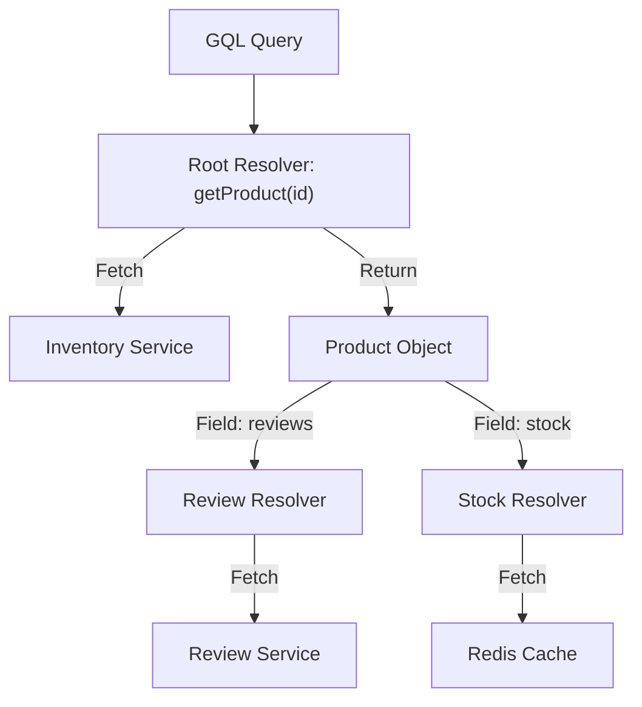

# 12. GraphQL Deep Dive

**Context:** RetailHub (Storefront Aggregation)  
**Focus:** Schema, Resolvers, N+1 Problem, Federation  
**Role:** Frontend / Backend Engineer

---

## 1. Executive Overview
REST is great for services, but "Chatty" for Frontends. To render a Product Page, the frontend needs: Product Info, Stock, Reviews, Related Items. That's 4 REST calls. **GraphQL** allows fetching all this in **1 Request**. RetailHub plans to use GraphQL as an Aggregation Layer (BFF).

---

## 2. Basics: Core Concepts & Glossary

### 2.1 The Graph
-   **Schema (SDL):** Typed definition (`type Product { id: ID, name: String }`).
-   **Query:** Read data.
-   **Mutation:** Write data.
-   **Resolver:** Function that fetches the data for a field.

### 2.2 Mental Model
REST is like ordering dish by dish. GraphQL is a buffet—you take exactly what you want on one plate.

---

## 3. Intermediate: Implementation Patterns

### 3.1 Resolvers & Data Fetchers
In Spring Boot (Kickstart GraphQL):
-   `QueryResolver`: Root entry point.
-   `FieldResolver`: Resolves children.
    -   *Example:* `Product.reviews` resolver calls `ReviewService`.

### 3.2 The N+1 Problem
**Scenario:** Query 10 Products. For each, fetch Reviews.
-   **Naive:** 1 DB call for Products + 10 DB calls for Reviews.
-   **Solution:** **DataLoader**. Batch requests. 1 call for Products. 1 call for *all* Reviews (`SELECT * FROM reviews WHERE product_id IN (...)`).

---

## 4. Advanced: Scaling the Graph

### 4.1 Federation (Apollo)
**Scenario:** Monolithic GraphQL gateway becomes a bottleneck.
-   **Architecture:**
    -   Inventory Service exposes a "Subgraph".
    -   Review Service exposes a "Subgraph".
    -   **Gateway** stitches them together into one Supergraph.
    -   *RetailHub:* Future state. Currently Monolithic module.

### 4.2 Error Handling
GraphQL usually returns `200 OK` even for errors.
-   **Partial Success:** `data` has some fields, `errors` array has exceptions.
-   **Contract:** Frontend must check `errors` array.

---

## 5. Architecture Visuals

### 5.1 Resolver Flow


---

## 6. Code & Config Examples

### 6.1 Schema (`schema.graphqls`)
```graphql
type Query {
    product(id: ID!): Product
}

type Product {
    id: ID!
    title: String
    price: Float
    reviews: [Review] # Field Resolver
}
```

### 6.2 Spring Controller (DGS / Spring GraphQL)
```java
@Controller
public class ProductDataFetcher {

    @QueryMapping
    public Product product(@Argument String id) {
        return inventoryClient.getProduct(id);
    }

    @SchemaMapping(typeName = "Product") // Solves "reviews" field
    public List<Review> reviews(Product product, DataLoader<String, List<Review>> loader) {
        return loader.load(product.getId()); // Batched!
    }
}
```

---

## 7. Operational Playbook

### 7.1 Complexity Limits
**Risk:** Malicious user queries depth 1000 (`friend { friend { friend ... } }`).
-   **Guard:** **Max Query Depth** (e.g., 10).
-   **Guard:** **Query Cost Analysis** (Assign "points" to fields).

---

## 8. Security & Compliance Notes

-   **Introspection:** Disable Schema Introspection in Production! (Don't let hackers map your entire API).
-   **Auth:** Apply `@PreAuthorize` on Field Resolvers. (e.g., Only Admin can resolve `Product.costPrice`).

---

## 9. Interview Prep

### 9.1 Common Questions
1.  **Q:** REST vs GraphQL?
    -   *A:* REST: Caching is easy (HTTP), Data is Over-fetched using standard endpoints. GQL: Caching is hard (POST), Exact fetching, Single Endpoint.
2.  **Q:** What is Schema Stitching?
    -   *A:* Merging local schemas. Precursor to Federation.

### 9.2 Whiteboard Prompt
*"Design a GraphQL schema for a Social Media feed."*
-   **Types:** `Post`, `User`, `Comment`.
-   **Relationships:** `Post.author -> User`, `Post.comments -> [Comment]`.
-   **Pagination:** Use "Connection" pattern (Cursors).

---

## 10. Practice Exercises

1.  **Basic:** Create a simple GQL server returning "Hello World".
2.  **Intermediate:** Implement a DataLoader to batch fetch User profiles for a list of Orders.
3.  **Advanced:** Set up a GraphQL Subscription over WebSockets for "Order Status Updates".

---

## 11. Checklists

### Production Readiness
- [ ] **Timeout:** Is global timeout configured?
- [ ] **Complexity:** Is Depth Limited?
- [ ] **Logging:** Are errors logged with stack traces (server side) but hidden from client?

---

## 12. References
-   *GraphQL Specification*
-   *Production Ready GraphQL* (Book)
