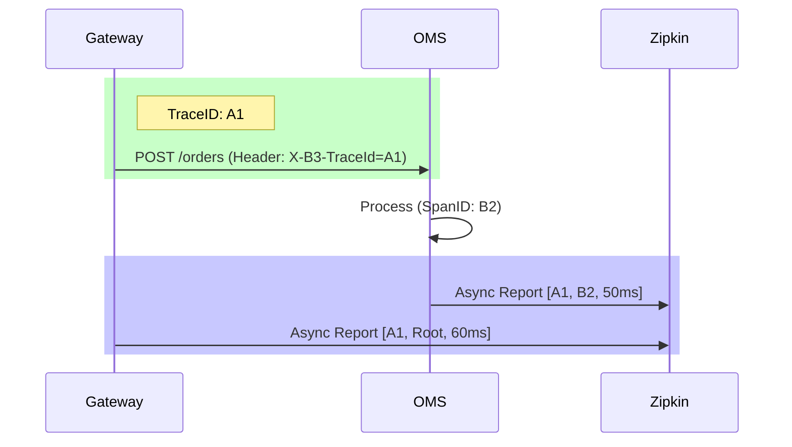

# 13. Observability Deep Dive

**Context:** RetailHub (Operations)  
**Focus:** Logs, Metrics, Tracing, Dashboards  
**Role:** SRE / DevOps

---

## 1. Executive Overview
"Monitoring tells you the system is dead. Observability tells you **why**."
In a system with 5+ microservices, a CLI error "500 Internal Server Error" is useless. Is it the Gateway? The DB? Kafka? We need **Distributed Tracing** (Zipkin), **Structured Logging** (ELK/Loki), and **Metrics** (Prometheus).

---

## 2. Basics: Core Concepts & Glossary

### 2.1 The Three Pillars
1.  **Logs:** "Event happened." (e.g., "Order 123 failed"). High volume, detailed.
2.  **Metrics:** "Aggregated state." (e.g., "CPU is 80%"). Low volume, trendable.
3.  **Traces:** "Request journey." (e.g., Gateway -> OMS -> Payment).

### 2.2 Tools Stack
-   **Zipkin:** Tracing Backend.
-   **Micrometer:** Java Facade for metrics.
-   **Prometheus:** Time-Series DB for metrics.
-   **Grafana:** Visualization/Dashboards.
-   **OpenTelemetry (OTel):** Standard for collection.

---

## 3. Intermediate: Implementation

### 3.1 Distributed Tracing (Zipkin/Brave)
**Mechanism:**
-   **Trace ID:** Unique ID for main request (User Click).
-   **Span ID:** Unique ID for sub-operation (Check Stock).
-   **Propogation:** Headers `X-B3-TraceId` passed via Feign/Rest/Kafka.
-   *Result:* Waterfall graph showing latency of every hop.

### 3.2 Structured Logging (JSON)
Text logs are hard to parse.
-   *Bad:* `INFO: User 123 logged in`
-   *Good:* `{"level":"INFO", "event":"login", "user_id":123, "trace_id":"abc"}`
-   Use `Logback` with JSON encoder.

---

## 4. Advanced: SLOs & Alerting

### 4.1 SLO (Service Level Objective)
-   **SLI (Indicator):** "95th percentile latency of /checkout".
-   **SLO (Goal):** "SLI should be < 500ms for 99% of requests".
-   **SLA (Contract):** "If we miss SLO, we pay you back".

### 4.2 Application Metrics
**Custom Metrics in RetailHub:**
-   `orders_placed_total` (Counter).
-   `inventory_stock_gauge` (Gauge).
-   `checkout_timer` (Timer/Histogram).

---

## 5. Architecture Visuals

### 5.1 Tracing Flow


---

## 6. Code & Config Examples

### 6.1 `logback-spring.xml` (JSON)
```xml
<appender name="CONSOLE" class="ch.qos.logback.core.ConsoleAppender">
    <encoder class="net.logstash.logback.encoder.LogstashEncoder">
        <includeContext>false</includeContext>
        <customFields>{"app":"oms-service"}</customFields>
    </encoder>
</appender>
```

### 6.2 Custom Metric (Java)
```java
@Service
public class OrderService {
    private final Counter orderCounter;

    public OrderService(MeterRegistry registry) {
        this.orderCounter = registry.counter("orders.placed", "type", "retail");
    }

    public void createOrder() {
        // Logic
        orderCounter.increment();
    }
}
```

---

## 7. Operational Playbook

### 7.1 "The Red Dashboard"
When Grafana lights up red:
1.  **Check Volume:** Is traffic abnormally high? (DDoS?)
2.  **Check Errors:** Is Error Rate > 1%?
3.  **Check Latency:** Is P99 spiking?
4.  **Drill Down:** Go to Zipkin, search for Trace IDs of failed requests.

---

## 8. Security & Compliance Notes

-   **Log Redaction:** **CRITICAL**. Never log Credit Cards or Passwords. Use Logback masking patterns.
-   **Metric Cardinality:** Don't put "User ID" in metric tags. 1M users = 1M metric series = Prometheus crash.

---

## 9. Interview Prep

### 9.1 Common Questions
1.  **Q:** Push vs Pull Metrics?
    -   *A:* Prometheus Pulls (scrapes). Better for knowing if service is down. Push (InfluxDB) better for event-driven / short lived jobs.
2.  **Q:** Why Sampling in Tracing?
    -   *A:* Tracing every request is expensive (storage/network). We sample 10% (probability = 0.1).

### 9.2 Whiteboard Prompt
*"Design a monitoring system for a payment gateway."*
-   **Key Metrics:** Success Rate (Golden Signal), Latency, Saturation (Thread Pool).
-   **Alerts:** "Success Rate < 98% for 5 mins" -> P1 Page.

---

## 10. Practice Exercises

1.  **Basic:** Run Zipkin locally (Docker). Make OMS call Inventory. See trace.
2.  **Intermediate:** Add a Gauge to track "Active Shopping Carts".
3.  **Advanced:** Create a Grafana Dashboard combining Logs (Loki) and Metrics (Prometheus).

---

## 11. Checklists

### Observability Readiness
- [ ] **Correlation ID:** Is it passed to Error Responses?
- [ ] **Health Checks:** Are DB/Kafka checks included in `/actuator/health`?
- [ ] **Retention:** Are logs rotated?

---

## 12. References
-   *Site Reliability Engineering* (Google)
-   *Micrometer Docs*
