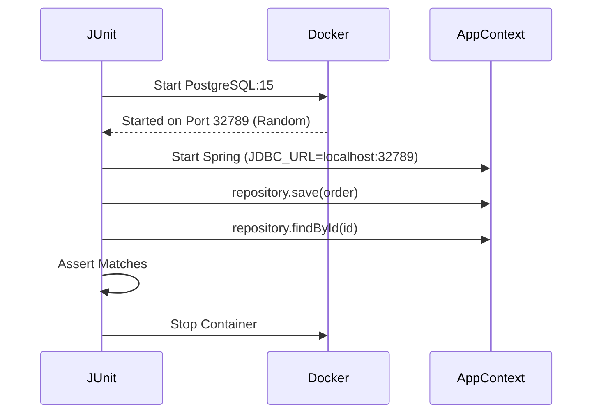

# 14. Testing Strategy Deep Dive

**Context:** RetailHub (QA)  
**Focus:** Unit, Integration, Testcontainers, E2E, Chaos  
**Role:** QA / SDET

---

## 1. Executive Overview
"It works on my machine" is forbidden. In Distributed Systems, bugs hide in the **gaps between services**. We follow the **Testing Pyramid**: broad base of Unit tests, middle layer of Integration tests (with real DBs), and thin tip of E2E tests.

---

## 2. Basics: Core Concepts & Glossary

### 2.1 The Pyramid in RetailHub
1.  **Unit:** JUnit 5. Mocks everything external. Fast (<1ms).
2.  **Integration (Slice):** `@DataJpaTest`. Bootstraps partial Context. Uses H2 or Testcontainers.
3.  **Component:** `@SpringBootTest`. Boots full app. Mocks other microservices (WireMock).
4.  **E2E:** Cypress/Selenium. Real Browser -> Gateway -> All Services (Dockerized).

### 2.2 Testcontainers
The best way to do integration testing. Spins up **Real Docker Containers** (Postgres, Kafka) during the test. No more H2/EmbeddedKafka discrepancies.

---

## 3. Intermediate: Techniques

### 3.1 Contract Testing (Pact / Spring Cloud Contract)
**Scenario:** OMS expects Inventory to return `{ "qty": 10 }`. Inventory changes field to `{ "quantity": 10 }`. OMS breaks in Prod.
-   **Solution:** Contract Tests.
    -   Consumer (OMS) defines a contract.
    -   Provider (Inventory) verifies it during *their* build.

### 3.2 Performance Testing (k6)
**Scenario:** Black Friday prep.
-   **Scripts:** Identify key user journeys (Browse -> Add Cart -> Pay).
-   **Load:** Simulate 1,000 VUs (Virtual Users).

---

## 4. Advanced: Chaos Engineering

### 4.1 Chaos Monkey
**Premise:** Things *will* fail. Fail them on purpose to test resilience.
-   **Action:** Kill the `Inventory` container.
-   **Expectation:** `OMS` Circuit Breaker opens. Checkout fails gracefully (not 500 Stack Trace).

---

## 5. Architecture Visuals

### 5.1 Testcontainers Flow


---

## 6. Code & Config Examples

### 6.1 Testcontainers (JUnit 5)
```java
@SpringBootTest
@Testcontainers
class OrderRepoTest {

    @Container
    static PostgreSQLContainer<?> postgres = new PostgreSQLContainer<>("postgres:15");

    @DynamicPropertySource
    static void props(DynamicPropertyRegistry registry) {
        registry.add("spring.datasource.url", postgres::getJdbcUrl);
        registry.add("spring.datasource.username", postgres::getUsername);
        registry.add("spring.datasource.password", postgres::getPassword);
    }

    @Test
    void testSave() { ... }
}
```

### 6.2 k6 Load Script (JS)
```javascript
import http from 'k6/http';
import { check, sleep } from 'k6';

export const options = {
  vus: 100,
  duration: '30s',
};

export default function () {
  const res = http.get('http://api-gateway:8080/api/products');
  check(res, { 'status was 200': (r) => r.status == 200 });
  sleep(1);
}
```

---

## 7. Operational Playbook

### 7.1 Flaky Tests
-   **Symptom:** Test fails 1/10 times.
-   **Cause:** Async race conditions (e.g., Asserting Kafka message arrived before consumer processed it).
-   **Fix:** Use `Awaitility` (`await().untilAsserted(...)`).

---

## 8. Security & Compliance Notes

-   **Test Data Management:** **NEVER** use real production data dumps for testing PII.
-   **Synthetic Data:** Use `JavaFaker` or `DataFactory` to generate realistic names/emails.

---

## 9. Interview Prep

### 9.1 Common Questions
1.  **Q:** Mock vs Stub vs Spy?
    -   *A:* Mock = Expectations ("Was I called?"). Stub = Canned answers ("Return 5"). Spy = Real object wrapper.
2.  **Q:** TDD (Test Driven Development)?
    -   *A:* Red (Fail) -> Green (Pass) -> Refactor.

### 9.2 Whiteboard Prompt
*"Design a CI/CD test stage for a payment service."*
-   *Steps:* Lint -> Unit Tests -> Integration (Testcontainers) -> Contract Verify -> Deploy to Staging -> E2E Smoke Test.

---

## 10. Practice Exercises

1.  **Basic:** Write a JUnit test for a calculator class logic.
2.  **Intermediate:** Use Testcontainers to test a Repository with a custom SQL query.
3.  **Advanced:** Create a k6 script that ramps up traffic to the Gateway and asserts the 95th percentile latency is < 200ms.

---

## 11. Checklists

### Merge Request Standards
- [ ] **Coverage:** Did coverage drop?
- [ ] **Tests:** Are there assertions? (No `assertTrue(true)`).
- [ ] **Speed:** Do Unit tests run in < 10ms?

---

## 12. References
-   *Testcontainers Documentation*
-   *k6 Documentation*
