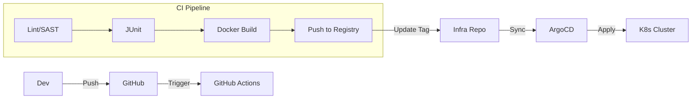

# 15. DevOps & CI/CD Deep Dive

**Context:** RetailHub (Delivery Pipeline)  
**Focus:** Pipelines, Quality Gates, Helm, Canary  
**Role:** DevOps Engineer

---

## 1. Executive Overview
Code on a laptop provides no value. Value comes when code runs in Production. **DevOps** is the culture and tooling to move code from `monitor` -> `prod` safely and quickly. RetailHub uses **GitHub Actions** for CI and **ArgoCD** (GitOps) for CD.

---

## 2. Basics: Core Concepts & Glossary

### 2.1 The Pipeline
1.  **CI (Continuous Integration):** Build, Test, Scan. Artifact = Docker Image.
2.  **CD (Continuous Deployment/Delivery):** Release Artifact to Env.

### 2.2 Quality Gates
Automated checks that stop the line.
-   **Static Analysis (SAST):** Check code for bugs (SonarQube).
-   **Security Scan:** Check lib vulnerabilities (Snyk/Trivy).
-   **Coverage:** Minimum 80%.

---

## 3. Intermediate: Deployment Strategies

### 3.1 Blue/Green (Switch)
-   **Blue:** Live (v1).
-   **Green:** Idle (v2).
-   **Deploy:** Update Green. Test Green. Switch Load Balancer to Green.
-   *Pro:* Zero Downtime, Instant Rollback. *Con:* Double Cost (Resources).

### 3.2 Rolling Update (K8s Default)
-   Replace pods one by one. (3 replicas -> 1 v2, 2 v1 -> 2 v2, 1 v1 -> 3 v2).
-   *Pro:* Cheap. *Con:* Mixed versions live simultaneously.

### 3.3 Canary (Statistical)
-   Send 5% traffic to v2. Check Errors. Increase to 20%, 50%, 100%.

---

## 4. Advanced: GitOps

### 4.1 "Operation by Pull Request"
We don't run `kubectl apply`.
1.  Dev merges into `main`.
2.  CI builds image `oms:v2`.
3.  CI commits change to `infra-repo` (`values.yaml` -> `image: oms:v2`).
4.  **ArgoCD** sees change in `infra-repo` and syncs K8s cluster.

---

## 5. Architecture Visuals

### 5.1 CI/CD Flow


---

## 6. Code & Config Examples

### 6.1 GitHub Actions (`ci.yml`)
```yaml
name: RetailHub CI

on: [push]

jobs:
  build:
    runs-on: ubuntu-latest
    steps:
      - uses: actions/checkout@v3
      - name: Set up JDK
        uses: actions/setup-java@v3
        with:
          java-version: '17'
      - name: Maven Test
        run: mvn verify
      - name: Docker Build
        run: docker build -t myregistry/oms:${{ github.sha }} .
      - name: Scan Image
        uses: aquasecurity/trivy-action@master
        with:
          image-ref: 'myregistry/oms:${{ github.sha }}'
```

---

## 7. Operational Playbook

### 7.1 Broken Build
-   **Rule:** If `main` build fails, **Stop the Line**. No new features until fixed.
-   **ChatOps:** Slack notification sends alert.

### 7.2 Rollback
-   **GitOps:** `git revert <commit-id>` on the Infra Repo. ArgoCD handles the rest.

---

## 8. Security & Compliance Notes

-   **Secrets:** NEVER store secrets in `yaml`. Use `SealedSecrets` or Vault. CI injects them into ENV, but logs must mask them.
-   **Least Privilege:** CI Runner should have permission to Push to Registry, but *not* to Delete from Registry.

---

## 9. Interview Prep

### 9.1 Common Questions
1.  **Q:** Immutable Infrastructure?
    -   *A:* Never SSH into a server to patch it. Build a new Image and replace the server/pod.
2.  **Q:** What is DAST?
    -   *A:* Dynamic Application Security Testing. Hacking the running app (OWASP ZAP) in Staging.

### 9.2 Whiteboard Prompt
*"Design a pipeline that prevents SQL Injection vulnerabilities from reaching prod."*
-   **Solution:** SAST step (SonarQube) looks for concatenation in SQL strings. Pipeline fails if found.

---

## 10. Practice Exercises

1.  **Basic:** Create a GitHub Action that prints "Hello" on push.
2.  **Intermediate:** Write a Dockerfile for a Spring Boot app using Multi-Stage builds (Maven image -> JRE image).
3.  **Advanced:** Set up a Minikube cluster and use Helm to install a customizable Nginx chart.

---

## 11. Checklists

### Pipeline Health
- [ ] **Speed:** build < 10 mins?
- [ ] **Idempotency:** Can I run the deploy script twice safely?
- [ ] **Feedback:** Do devs get Slack alerts on fail?

---

## 12. References
-   *The DevOps Handbook*
-   *Accelerate (DORA Metrics)*
