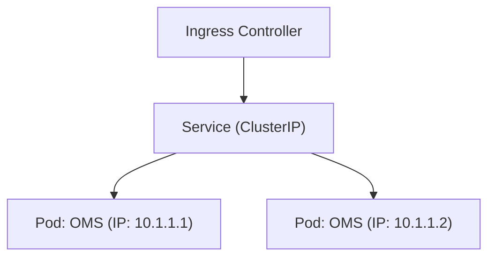

# 16. Docker & Kubernetes Deep Dive

**Context:** RetailHub (Containerization)  
**Focus:** Best Practices, Security, Autoscaling, Probes  
**Role:** Cloud Engineer

---

## 1. Executive Overview
RetailHub runs on **Kubernetes (K8s)**. Containers wrap our Java jars and Node apps into standardized units. K8s orchestrates them—scheduling, restarting, and sealing. This abstracts the underlying hardware from the application logic.

---

## 2. Basics: Core Concepts & Glossary

### 2.1 The Pod
-   Smallest unit of K8s.
-   Can hold 1+ containers (Sidecar pattern).
-   RetailHub: 1 Pod = 1 Microservice Instance (+ optional Istio sidecar).

### 2.2 Controllers
-   **Deployment:** Manages generic stateless apps.
-   **StatefulSet:** Manages DBs/Kafka (Stable network ID).
-   **DaemonSet:** Runs on every node (Logs/Monitoring).

---

## 3. Intermediate: Best Practices

### 3.1 Resource Limits (The "Fair Share" Rule)
**Always define:**
-   **Requests:** "I need at least 500m CPU". (For Scheduling).
-   **Limits:** "Kill me if I use > 1000m CPU". (For Stability).
-   *Java Note:* set `-XX:MaxRAMPercentage` so JVM sees container limit, not host RAM.

### 3.2 Probes (Health Checks)
-   **Liveness:** "Am I dead?" (K8s restarts pod).
-   **Readiness:** "Can I take traffic?" (K8s adds to LoadBalancer).
-   *RetailHub:* Liveness checks internal state. Readiness checks DB connection.

---

## 4. Advanced: Autoscaling

### 4.1 HPA (Horizontal Pod Autoscaler)
Scales based on CPU/RAM.
-   *Rule:* If CPU > 70%, add replicas.
-   *Constraint:* Need buffer (Surge) for startup time.

### 4.2 KEDA (Event Driven Autoscaling)
Scales based on **Kafka Lag**.
-   *Scenario:* Black Friday. Queue fills up. CPU is low (IO bound). HPA does nothing. KEDA sees lag and scales up.

---

## 5. Architecture Visuals

### 5.1 Service Discovery

> **Note:** DNS revolves to `oms-service.default.svc`.

---

## 6. Code & Config Examples

### 6.1 `deployment.yaml`
```yaml
apiVersion: apps/v1
kind: Deployment
metadata:
  name: oms-deployment
spec:
  replicas: 3
  selector:
    matchLabels:
      app: oms
  template:
    metadata:
      labels:
        app: oms
    spec:
      containers:
      - name: oms
        image: myregistry/oms:v1
        ports:
        - containerPort: 8080
        resources:
          requests:
            memory: "512Mi"
            cpu: "250m"
          limits:
            memory: "1Gi"
            cpu: "500m"
        livenessProbe:
          httpGet:
            path: /actuator/health/liveness
            port: 8080
          initialDelaySeconds: 30
```

### 6.2 Dockerfile Best Practice (Distroless)
```dockerfile
# Stage 1: Build
FROM maven:3.8-openjdk-17 AS build
COPY . /app
RUN mvn package

# Stage 2: Run (Distroless = No Shell, Safer)
FROM gcr.io/distroless/java17-debian11
COPY --from=build /app/target/app.jar /app.jar
CMD ["app.jar"]
```

---

## 7. Operational Playbook

### 7.1 "CrashLoopBackOff"
-   **Symptom:** Pod starts, dies, restarts loop.
-   **Debug:** `kubectl logs <pod> --previous`.
-   **Common Cause:** Missing Env Var, Database unreachable.

### 7.2 Node Pressure
-   **Symptom:** Pods stuck in `Pending`.
-   **Cause:** Cluster out of CPU/RAM.
-   **Fix:** Cluster Autoscaler (Add EC2 nodes).

---

## 8. Security & Compliance Notes

-   **Run as Non-Root:** Standard in RetailHub. `securityContext: runAsUser: 1000`. Prevents container breakout attacks.
-   **Image Scanning:** Block images with Critical CVEs in Admission Controller.

---

## 9. Interview Prep

### 9.1 Common Questions
1.  **Q:** Docker vs VM?
    -   *A:* VM = Hardware Virtualization (Heavy OS). Docker = OS Virtualization (Shared Kernel).
2.  **Q:** Headless Service?
    -   *A:* Service without ClusterIP. Returns list of Pod IPs. Used for DB clusters (StatefulSets) discovery.

### 9.2 Whiteboard Prompt
*"Architect a K8s cluster for High Availability."*
-   **Solution:** Multi-AZ (Availability Zone). Masters distributed. Worker nodes distributed. Topology Spread Constraints to force pods across AZs.

---

## 10. Practice Exercises

1.  **Basic:** Run `kubectl run nginx --image=nginx`. Port forward to localhost.
2.  **Intermediate:** Create a Deployment with 3 Replicas and kill one pod. Watch it recreate.
3.  **Advanced:** configure **KEDA** to scale a consumer based on Kafka topic lag.

---

## 11. Checklists

### K8s Manifest Review
- [ ] **Labels:** Are standard labels (app, version) present?
- [ ] **Probes:** Are readiness probes configured?
- [ ] **Secrets:** Are we referencing Secrets, not plain text env vars?

---

## 12. References
-   *Kubernetes.io Docs*
-   *Docker Best Practices*
