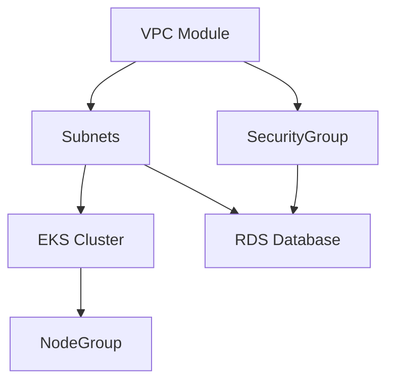

# 17. Terraform & IAC Deep Dive

**Context:** RetailHub (Cloud Provisioning)  
**Focus:** Modules, State, Secrets, Networking  
**Role:** Cloud Architect

---

## 1. Executive Overview
We don't click buttons in the AWS Console. We define Infrastructure as Code (**IaC**) using Terraform. This ensures our Staging environment is an exact replica of Production, reducing "It worked in Dev" bugs related to networking or IAM.

---

## 2. Basics: Core Concepts & Glossary

### 2.1 The State File (`terraform.tfstate`)
-   Maps your code (`resource "aws_s3_bucket"`) to real IDs (`bucket-123`).
-   **Critical:** Must be stored remotely (S3 + DynamoDB Lock). Do NOT commit to Git.

### 2.2 Modules
-   Reusable components.
-   *RetailHub:* `modules/microservice-db` creates:
    -   RDS Instance
    -   Security Group
    -   Secrets Manager Secret.

---

## 3. Intermediate: Pattern

### 3.1 Workspaces vs Directories
-   **Directory per Env:** `env/dev`, `env/prod`. Best for isolation. RetailHub usage.
-   **Workspaces:** Single code, multiple states. Riskier (easy to apply 'prod' by mistake).

### 3.2 Networking (The VPC)
-   **Public Subnet:** ALB (Load Balancer), NAT Gateway.
-   **Private Subnet:** EKS Nodes, RDS, Elasticache.
-   **Rule:** Databases never have public IPs.

---

## 4. Advanced: Managing Secrets

### 4.1 The Chicken and Egg
How to pass DB Password to K8s?
1.  Terraform generates Random Password.
2.  Terraform stores in AWS Secrets Manager.
3.  Terraform creates K8s `ExternalSecret` manifest.
4.  K8s Operator syncs Secret to Pod.

---

## 5. Architecture Visuals

### 5.1 Terraform Dependency Graph


---

## 6. Code & Config Examples

### 6.1 `main.tf` (Calling a Module)
```hcl
module "oms_db" {
  source = "./modules/postgres"
  
  app_name   = "oms"
  env        = "prod"
  vpc_id     = module.vpc.vpc_id
  subnet_ids = module.vpc.private_subnets
  
  instance_class = "db.t3.medium"
}
```

### 6.2 `outputs.tf`
```hcl
output "db_endpoint" {
  value     = module.oms_db.endpoint
  sensitive = false
}
```

---

## 7. Operational Playbook

### 7.1 "State Lock"
-   **Error:** "Error acquiring the state lock".
-   **Cause:** CI/CD crashed mid-apply.
-   **Fix:** `terraform force-unlock <id>` (Careful!).

### 7.2 Drift Detection
-   **Scenario:** Someone manually changed a Security Group in AWS Console.
-   **Action:** Daily `terraform plan` cron job alerts on diffs.

---

## 8. Security & Compliance Notes

-   **Least Privilege:** The CI/CD Role running Terraform should probably differ for Dev vs Prod accounts.
-   **Sensitive Data:** Mark output variables as `sensitive = true` so passwords don't show in CI logs.

---

## 9. Interview Prep

### 9.1 Common Questions
1.  **Q:** Mutable vs Immutable infrastructure?
    -   *A:* Terraform + AMI/Docker = Immutable. Chef/Puppet = Mutable.
2.  **Q:** `count` vs `for_each`?
    -   *A:* `for_each` is safer. `count` relies on list index (array). Removing item 0 shifts all indices, forcing recreation of all resources.

### 9.2 Whiteboard Prompt
*"Design the IaC for a 3-tier web app."*
-   **Layers:** LB (Public), App InStances (Private), DB (Private).
-   **Security Groups:** Chained. LB -> App. App -> DB.

---

## 10. Practice Exercises

1.  **Basic:** Write TF to create an S3 bucket.
2.  **Intermediate:** Modularize the S3 bucket creation to enforce encryption and tagging.
3.  **Advanced:** Use `remote-exec` (rare) or `local-exec` to trigger an Ansible playbook after EC2 creation.

---

## 11. Checklists

### PR Code Review
- [ ] **Hardcoding:** Are IDs/ARNs hardcoded? (Use Data Sources).
- [ ] **Formatting:** Did you run `terraform fmt`?
- [ ] **Plan:** Did you attach the plan output to the PR?

---

## 12. References
-   *Terraform: Up & Running*
-   *HashiCorp Registry*
